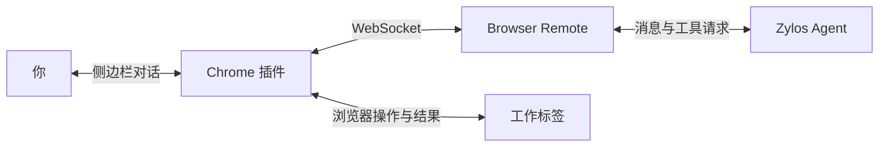

<p align="center">
  
</p>

<h1 align="center">Zylos Browser</h1>

<p align="center">
  <strong>让你的 Zylos Agent，在 Chrome 中与你一起工作。</strong><br />
  在侧边栏里聊天，让 Agent 打开网页、查找信息、填写表单，并完成浏览器任务。
</p>

<p align="center">
  
  
  
</p>

<p align="center">
  <a href="#features">功能</a> ·
  <a href="#quick-start">快速开始</a> ·
  <a href="#how-it-works">工作原理</a> ·
  <a href="docs/DEVELOPMENT.md">开发指南</a> ·
  <a href="https://github.com/zylos-ai/zylos-browser-extension/issues">反馈问题</a>
</p>

---

Zylos Browser 是 Zylos Agent 的 Chrome 插件。在同一个侧边栏里，你既可以日常聊天，也可以把浏览器任务交给 Agent。执行任务时，插件会创建专用工作标签，显示操作光标和任务状态，你可以随时停止。

插件运行在你的 Chrome 中，Agent 可以运行在本机或远程服务器，通过 [Zylos Browser Remote](https://github.com/zylos-ai/zylos-browser-remote) 连接。

<a id="features"></a>

## 在浏览器里，完成更多事

| 功能               | 你可以做什么                                                  |
| ------------------ | ------------------------------------------------------------- |
| **侧边栏对话**     | 与已连接的 Zylos Agent 聊天；需要操作网页时，直接描述任务。   |
| **网页交互**       | 打开与切换工作标签、查找元素、点击、输入、滚动和填写表单。    |
| **页面观察**       | 通过页面快照、文本和截图，让 Agent 了解网页当前的内容与状态。 |
| **可见的执行过程** | 查看任务状态和页面上的操作光标，在侧边栏中停止任务。          |
| **专用工作标签**   | 在 `zylos` 标签组中执行任务，最终回复后释放控制并保留结果页。 |
| **中文与英文界面** | 默认跟随浏览器语言，也可以在设置中手动切换。                  |

试着从一个简单的请求开始：

> 打开 example.com，告诉我这个页面介绍了什么。

> 打开 YouTube，搜索「明日之丈」。

> 不用操作浏览器，帮我整理一下今天的工作计划。

普通聊天无需调用浏览器工具。浏览器任务的具体步骤由连接的 Agent 根据你的请求和页面状态决定。

<a id="quick-start"></a>

## 快速开始

你需要 **Chrome 125+** 和一个可用的 **Zylos Agent**。以下步骤从源码安装插件，构建需要 **Node.js 22+**。

### 1. 安装插件

```sh
git clone https://github.com/zylos-ai/zylos-browser-extension.git
cd zylos-browser-extension
npm ci
npm run build
```

打开 `chrome://extensions`，开启 **开发者模式** → **加载已解压的扩展程序**，选择本仓库的 **`.output/chrome-mv3`** 目录。

建议将 Zylos 固定到 Chrome 工具栏，点击章鱼图标即可打开侧边栏。更新源码并重新构建后，需要在扩展管理页点击 **重新加载**。

<details>
<summary>macOS 中找不到 .output 目录？</summary>

Finder 默认隐藏以点开头的目录。按 `Command + Shift + .` 显示隐藏目录，或在目录选择框中按 `Command + Shift + G` 输入完整路径。

</details>

### 2. 获取 Agent 的连接信息

如果已经配置了 Browser Remote，直接使用已有的连接地址和完整 Key。首次连接时，把下面的提示词复制到你原来与 Zylos Agent 对话的入口，让它按安装文档配置服务。

<details>
<summary><strong>展开并复制：让 Agent 配置 Browser Remote</strong></summary>

适用于已经在线上运行、拥有独立 HTTPS 地址的 Zylos Agent。

```text
请帮我安装并配置 Zylos Browser Remote，让我能通过 Chrome 插件和你聊天，并让你操作我的浏览器。我确认安装（confirm）。

请先阅读安装说明：
https://github.com/zylos-ai/zylos-browser-remote/blob/main/README.md

然后完成：
1. 检查是否已安装 browser-remote；已安装则复用。
2. 使用你现有的公网 HTTPS 域名，配置 WebSocket 转发路由。
3. 启动服务，检查 Relay 和公网入口是否可用。
4. 为我的 Chrome 插件生成一个连接 Key。
5. 读取组件 SKILL.md 了解传输入口；连接后通过 describe 读取插件提供的工具和操作指南。

完成后，请直接在当前对话返回：
地址：wss://你的真实域名/browser-remote/ext
Key：本次生成的完整密钥，不是 keyId

我会把这两项填入插件设置，然后与你验证聊天和浏览器操作。
```

地址复用 Agent 已有的域名，Agent 仍需配置 `/browser-remote/` 的转发路由。这些步骤由 Agent 按文档执行，目前尚未整合成一键配对命令。

</details>

Agent 应当返回两项信息，例如：

| 字段                  | 示例                                         |
| --------------------- | -------------------------------------------- |
| 服务地址（Relay URL） | `wss://alice.example.com/browser-remote/ext` |
| 连接 Key              | Agent 生成的完整连接密钥                     |

**使用完整 Key，而不是短的 `keyId`。** 每个 Chrome profile 应使用独立 Key，同一个 Key 的新连接会替换旧连接。

### 3. 连接并开始聊天

打开侧边栏的 **设置**，填写服务地址和 Key，点击 **保存并连接**。

显示已连接后，先发送一条消息，确认 Agent 能回复；再试试「打开 example.com」，浏览器中应出现名为 `zylos` 的工作标签组。

连接配置保存在当前 Chrome profile 的插件本地存储中，再次打开侧边栏无需重新填写。

> **使用远程 Agent？** 你的电脑只需安装插件，Remote 和 Agent 运行在服务器上。使用 Agent 返回的 `wss://` 地址即可，无需在本机启动 `Browser-dev.sh`。`ws://127.0.0.1:3802/ext` 仅适用于 Chrome 和 Relay 位于同一台电脑的本地联调。

<a id="how-it-works"></a>

## 工作原理



| 项目                                                                   | 职责                                                        |
| ---------------------------------------------------------------------- | ----------------------------------------------------------- |
| **本仓库 · Chrome 插件**                                               | 侧边栏、浏览器执行器、工具定义、参数校验和 Agent 操作指南。 |
| **[Browser Remote](https://github.com/zylos-ai/zylos-browser-remote)** | 连接插件与 Agent，转发请求和结果，处理聊天投递与图片附件。  |
| **Zylos Core / Agent**                                                 | 接收用户请求，由模型决定调用哪些工具并生成回复。            |

浏览器能力由插件提供。Agent 在首次执行浏览器操作前调用 `describe`，读取当前插件的工具目录和操作指南；新增普通浏览器动作时，无需在 Remote 中再维护一份工具清单。

执行链路、端口分工、任务生命周期和目录地图见 [开发指南](docs/DEVELOPMENT.md)。

## 开发与贡献

项目基于 **WXT · React · TypeScript · Zod**，使用 **Tailwind CSS / DaisyUI** 构建侧边栏界面。

```sh
npm run dev         # WXT 开发模式
npm test            # 类型检查与单元测试
npm run test:build  # 构建与产物检查
npm run test:e2e    # 真实 Chrome 与 Relay 的端到端测试
npm run zip         # 生成插件压缩包
```

端到端测试需要 Chrome 和相邻的 `zylos-browser-remote` 仓库；可通过 `CHROME_PATH`、`RELAY_ROOT` 指定路径。完整环境与验证说明见 [开发指南](docs/DEVELOPMENT.md#8-常用命令与验证)。

欢迎提交 Issue 或 Pull Request。报告问题时，请附上 Chrome / 插件版本、复现步骤，以及相关错误信息；新增浏览器动作时，请同时更新工具说明和对应测试。

## 常见问题

| 现象                     | 检查方向                                                                                            |
| ------------------------ | --------------------------------------------------------------------------------------------------- |
| 无法连接                 | 检查完整 `wss://` 地址、`/browser-remote/ext` 路径和完整 Key；由 Agent 检查证书、代理路由与 Relay。 |
| 已连接，但聊天无回复     | 由 Agent 检查 C4 消息通道、Agent 运行状态与 Remote 的回复脚本。                                     |
| 聊天正常，但无法操作网页 | 由 Agent 检查 `info` 和动作错误，并按插件 `describe` 返回的指南调用工具。                           |
| 更新后仍显示旧能力       | 重新构建，在 Chrome 扩展管理页重新加载，并核对加载的是当前仓库的 `.output/chrome-mv3`。             |

## 文档

| 文档                                                                                       | 内容                                               |
| ------------------------------------------------------------------------------------------ | -------------------------------------------------- |
| [开发指南](docs/DEVELOPMENT.md)                                                            | 项目架构、执行链路、目录地图、界面开发与本地验证。 |
| [浏览器动作](docs/BROWSER-ACTIONS.md)                                                      | 动作参数、执行边界与验证记录。                     |
| [Agent 操作指南](agent/browser-guide.md)                                                   | 随插件提供的浏览器工作流程与错误恢复说明。         |
| [工具目录源码](utils/tool-catalog.ts)                                                      | 工具用途、约束、例子与动态参数描述。               |
| [Remote 安装与部署](https://github.com/zylos-ai/zylos-browser-remote#readme)               | 连接服务的安装、配置与 Agent 接入。                |
| [Remote 协议](https://github.com/zylos-ai/zylos-browser-remote/blob/main/docs/PROTOCOL.md) | 消息格式、传输接口与错误响应。                     |
