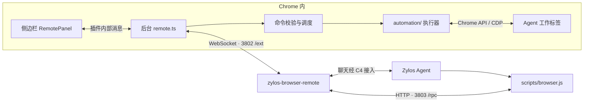

# Coco Browser Extension

Coco 是运行在 Chrome 中的浏览器插件。你在**侧边栏（Sidebar）**里与 Zylos Agent 聊天，
Agent 通过插件在专用工作标签中操作网页。点击 Chrome 工具栏中的 Coco 图标即可打开侧边栏。

**当前结构：一个侧边栏界面，一个后台入口，一套浏览器执行器。**
Agent 决定做什么，Relay 传递消息，插件把动作变成 Chrome 操作。
本文按当前 0.12.0 的代码组织，适合第一次阅读项目时使用。

## 1. 本仓库与其他项目的分工

| 项目                          | 运行在哪里                  | 职责                                                                 |
| ----------------------------- | --------------------------- | -------------------------------------------------------------------- |
| `zylos-browser-extension`     | 用户的 Chrome 内            | 侧边栏界面、连接管理、工作标签、浏览器操作和结果返回                 |
| `zylos-browser-remote`        | 本机或服务器的 Node.js 进程 | Relay 转发、Agent 命令入口 `scripts/browser.js`、命令说明 `SKILL.md` |
| `zylos-core` / Zylos 运行目录 | 本机或服务器                | C4 消息通道和 Agent 运行环境，由模型决定调用哪些动作                 |

Remote 是插件当前使用的连接方式，可以连接本机或服务器上的 Relay。
浏览器操作引擎在本仓库的 `utils/automation/`。



**3802 和 3803 都由 Relay 监听。** 插件主动连接 `ws://127.0.0.1:3802/ext`；
Agent 的命令入口访问 `http://127.0.0.1:3803/rpc`。
聊天与工具请求共用插件到 Relay 的 WebSocket，根据消息的 `type` 分流。

## 2. 目录地图

```text
zylos-browser-extension/
├── entrypoints/                    WXT 识别的两个插件入口
│   ├── background/
│   │   ├── index.ts                后台启动入口
│   │   └── remote.ts               连接、聊天、状态通知、命令接收
│   └── sidepanel/
│       ├── index.html              侧边栏页面外壳
│       └── main.tsx                挂载 React 界面并导入样式
├── components/
│   ├── RemotePanel.tsx             聊天、连接设置、查看任务和停止按钮
│   └── ErrorBoundary.tsx           界面出错时显示兜底信息
├── assets/
│   ├── design-tokens.css           品牌色、字体、间距、布局规范与 DaisyUI 主题
│   └── styles.css                  Tailwind / DaisyUI 入口与侧边栏基础样式
├── utils/
│   ├── remote.ts                   连接配置、消息格式、界面状态和存储键名
│   ├── remote-commands.ts          Agent 方法列表、排队、停止打断和去重
│   ├── commands.ts                 浏览器动作参数定义
│   ├── messages.ts                 只接受本插件侧边栏发来的内部请求
│   ├── guard.ts                    受限网址判断
│   └── automation/                浏览器操作实现
│       ├── executor.ts            工作标签、调试连接、导航、弹窗、等待和总调度
│       ├── page-actions.ts        元素定位、快照、控件状态和具体操作
│       ├── frames.ts              iframe 和子调试会话管理
│       ├── pointer-motion.ts      鼠标移动轨迹、点击前命中检查
│       ├── cursor.ts              生成可视光标的更新脚本
│       ├── task-lifecycle.ts      工作标签归属记录、清理和异常恢复
│       ├── types.ts               执行器的数据类型
│       └── injected/              按需在网页中执行的固定辅助函数
│           ├── dom-action.js      元素状态、焦点、表单和容器滚动
│           ├── page-query.js      CSS 查找、文本查询、Shadow DOM 遍历
│           └── cursor.js          绘制 Agent 的页面光标
├── tests/
│   ├── unit/                      参数、连接、执行器、鼠标、任务清理等测试
│   ├── fixtures/commands.cases.json  命令参数与默认值样例
│   ├── project-structure.test.ts   插件入口结构检查
│   ├── build.test.mjs             manifest、资源和产物检查
│   └── e2e/browser-actions.mjs     真实 Chrome + Relay 的端到端测试
├── docs/
│   └── BROWSER-ACTIONS.md          动作参数、实现步骤和验证记录
├── wxt.config.ts                  插件配置及 Tailwind 的 Vite 插件
├── package.json                   依赖、版本与 npm 命令
├── package-lock.json              依赖锁文件
├── tsconfig.json                  TypeScript 配置
├── vitest.config.ts               测试配置
├── .wxt/                          WXT 自动生成的类型与配置
├── .output/chrome-mv3/             Chrome 实际加载的构建产物
└── node_modules/                  npm 安装的依赖
```

修改功能时编辑源码，再运行构建。`.output/` 和 `.wxt/` 由 WXT 生成，手动修改会被下一次构建覆盖。
WXT 是插件开发框架，React 负责界面，TypeScript 用于代码检查，Zod 用于运行时校验消息和参数。

## 3. 两个入口如何启动

### 侧边栏入口

[sidepanel/main.tsx](entrypoints/sidepanel/main.tsx) 直接把
[RemotePanel](components/RemotePanel.tsx) 挂载到页面上，套上错误兜底组件并导入样式。
界面组件负责显示状态、接收输入、向后台发请求。

例如，发送聊天用 `remote-chat-send`，保存设置用 `remote-save`，停止任务用 `remote-stop`。
这些请求通过 `chrome.runtime.sendMessage` 在插件内部传递。
[messages.ts](utils/messages.ts) 检查请求来源必须是本插件的 `sidepanel.html`。

### 后台入口

[background/index.ts](entrypoints/background/index.ts) 调用
[startRemoteBackground()](entrypoints/background/remote.ts)，完成以下初始化：

1. 注册执行器和 Chrome 事件监听。
2. 处理任务清理记录，读取本地设置和聊天记录。
3. 用 Relay 地址与 key 建立 WebSocket，处理心跳和断线重连。
4. 接收侧边栏请求和 Relay 消息，把最新状态通知界面。
5. 设置工具栏按钮行为：点击插件图标打开侧边栏。

后台是 Chrome 管理的 Manifest V3 Service Worker。关闭侧边栏只关闭界面，连接和执行逻辑由后台管理。
Chrome 可能回收后台，因此代码会保存配置与清理记录；元素引用和在途操作不能跨后台重启继续使用。

| 数据                         | 保存位置                                  |
| ---------------------------- | ----------------------------------------- |
| Relay 地址、key、启用状态    | `chrome.storage.local` 的 `remoteConfig`  |
| 最近 200 条聊天记录          | `chrome.storage.local` 的 `remoteChatLog` |
| 工作标签归属及清理记录       | `chrome.storage.local` 的 `taskCleanupV1` |
| 当前连接、动作队列、元素 ref | 后台内存                                  |

## 4. 一条聊天、一次点击经过哪些文件

### 聊天流程

1. 你在 `RemotePanel.tsx` 输入文字，界面发送内部消息 `remote-chat-send`。
2. 后台 `remote.ts` 将它封装为 `{type:"chat", text, ts}`，经 WebSocket 送到 Relay。
3. Relay 把文字交给 C4，Agent 收到任务。
4. Agent 回复经 C4 发送脚本和 Relay 的 `/chat` 接口返回插件。
5. 后台收到 `type:"chat"` 后保存记录并通知侧边栏显示。

### 点击流程

1. Agent 根据相邻仓库的 `SKILL.md` 了解命令，通过 `scripts/browser.js` 提交 `click` 和参数。
2. Relay 的 `3803 /rpc` 接口接收请求，通过 WebSocket 发给插件，消息类型为 `req`。
3. 后台 `remote.ts` 将请求交给 [remote-commands.ts](utils/remote-commands.ts)，检查方法、参数、请求队列和重复 ID。
4. [executor.ts](utils/automation/executor.ts) 确认工作标签和调试连接，再调用 [page-actions.ts](utils/automation/page-actions.ts)。
5. 页面执行层解析元素引用，移动鼠标并点击，通过 Chrome API 读取操作结果。
6. 结果以 `resp` 或 `error` 原路返回 Agent，由 Agent 判断下一步。

`remote-chat-send` 是插件内部消息，`req` 是网络消息类型，`click` 是浏览器动作名。
这三个名称对应不同层次，分别解决界面通信、网络分流和动作执行的问题。

### CDP 指令从哪里产生

**Agent 选择动作，插件产生具体 CDP 调用。**
例如 `click` 最终使用 `Input.dispatchMouseEvent`，文字输入使用 `Input.insertText`，截图使用 `Page.captureScreenshot`。
CDP 是 Chrome DevTools Protocol，即 Chrome 的浏览器调试协议；插件通过 `chrome.debugger.sendCommand` 调用它。

标签创建和分组使用 `chrome.tabs`、`chrome.tabGroups`；页面查找、状态读取、原生下拉框等操作还会执行内置 DOM 辅助函数。
当前链路不需要额外安装 `agent-browser`，也不需要为日常使用开启 Chrome 远程调试端口。

## 5. 浏览器执行器的内部职责

| 文件                                                            | 主要职责                                                                            |
| --------------------------------------------------------------- | ----------------------------------------------------------------------------------- |
| [commands.ts](utils/commands.ts)                                | 定义每个动作的合法参数，例如点击必须提供 ref 或成对坐标                             |
| [remote-commands.ts](utils/remote-commands.ts)                  | 暴露 Agent 方法、声明能力、调度动作、去重、处理停止打断                             |
| [executor.ts](utils/automation/executor.ts)                     | 创建任务、选定工作标签、连接 debugger、导航、处理原生弹窗、等待条件、截图和结束任务 |
| [page-actions.ts](utils/automation/page-actions.ts)             | 快照、CSS 查找、控件状态、点击、拖拽、输入、组合键、选择和滚动                      |
| [frames.ts](utils/automation/frames.ts)                         | 管理 iframe 树与跨进程子调试会话                                                    |
| [pointer-motion.ts](utils/automation/pointer-motion.ts)         | 鼠标轨迹、视口坐标校验、移动前后目标检查                                            |
| [cursor.ts](utils/automation/cursor.ts) 和 `injected/cursor.js` | 在页面中绘制 Agent 的操作光标                                                       |
| [task-lifecycle.ts](utils/automation/task-lifecycle.ts)         | 记录任务拥有的标签、保留决定、清理结果与异常恢复依据                                |

### 元素引用与复杂页面

`find` 根据 CSS 选择器查找元素；`snapshot` 读取 Chrome 的可访问性树（AX tree），将按钮、输入框等整理成文字结果。
它们会分配类似 `@a1b2c3d4-e7` 的 ref。Agent 使用这个临时引用操作元素，插件内部记录对应节点、frame 和页面代次。
导航后需要重新 `find` 或 `snapshot`，旧 ref 会失效。

iframe 是页面中嵌套的另一份文档。`frames.ts` 管理其调试会话，`page-actions.ts` 处理定位与坐标换算。
Shadow DOM 是网页组件内部的 DOM 子树；CSS 查询会遍历 open Shadow DOM，closed root 中暴露到 AX 树的元素可以用快照 ref 操作。

`injected/` 内是插件自带的固定函数，以 `?raw` 方式打包，按需在元素所属页面环境中执行。
这里没有对 Agent 开放任意 JavaScript 的执行入口。

### 工作标签的生命周期

首次 `open` 调用 `createTask()`，在来源窗口中创建新工作标签并分组。当前任务最多包含 8 个工作标签，
网页从任务标签打开的新页也需要经过归属检查才能加入。后续命令针对选定的工作标签，用户切换前台页不会改变目标。

| 操作                  | 行为                                                             |
| --------------------- | ---------------------------------------------------------------- |
| `pause` / `finish`    | 释放调试连接，保留任务与标签；后续动作可恢复，长期闲置会自动释放 |
| `stop` / 侧边栏“停止” | 撤销控制，并按归属记录清理任务临时标签                           |
| `finalize`            | 结束任务、清理临时标签；用 `keep` 指定要保留的结果页             |

清理前仍会核验标签的窗口、分组和归属；用户移走的标签会交还用户。
具体动作参数和限制见 [BROWSER-ACTIONS.md](docs/BROWSER-ACTIONS.md)。

## 6. 修改功能时看哪里

| 想修改的内容                         | 优先查看                                                     |
| ------------------------------------ | ------------------------------------------------------------ |
| 聊天气泡、设置、按钮和状态文案       | `components/RemotePanel.tsx`                                 |
| 品牌色、字体、间距和布局变量         | `assets/design-tokens.css`                                   |
| 侧边栏样式、Tailwind 扫描范围        | `assets/styles.css`                                          |
| 保存配置、聊天收发、连接和重连       | `entrypoints/background/remote.ts`、`utils/remote.ts`        |
| 动作名称、参数、能力、排队与去重     | `utils/commands.ts`、`utils/remote-commands.ts`              |
| 鼠标、键盘、表单、元素状态、容器滚动 | `utils/automation/page-actions.ts`、`injected/dom-action.js` |
| CSS 查找、Shadow DOM 遍历            | `utils/automation/injected/page-query.js`、`page-actions.ts` |
| iframe、跨文档定位和坐标             | `utils/automation/frames.ts`、`page-actions.ts`              |
| 导航、等待、原生弹窗、新标签接续     | `utils/automation/executor.ts`                               |
| 工作标签清理与保留                   | `utils/automation/task-lifecycle.ts`                         |
| 插件名称、权限、版本                 | `wxt.config.ts`、`package.json`                              |
| 让 Agent 学会使用新命令              | 相邻仓库 `zylos-browser-remote/SKILL.md`                     |

新增普通动作的顺序是：定义参数 → 确认方法与调度策略 → 实现执行逻辑 → 同步 Agent 说明和测试。
Relay 的 `/rpc` 通用转发已有的方法名与参数，新增动作通常无需修改 Relay 服务。

第一次读代码推荐顺序：`sidepanel/main.tsx` → `RemotePanel.tsx` → 后台 `remote.ts` →
`remote-commands.ts` → `executor.ts` → `page-actions.ts`。

### 界面设计变量与 DaisyUI

[design-tokens.css](assets/design-tokens.css) 是设计变量规范文件，对应
[Figma 视觉规范](https://www.figma.com/design/qEYh0ltFkLaL0Wj7rW5Qll/zylos-extension?node-id=4-68)。
文件按原始色板、间距、圆角、布局、字体和 DaisyUI 主题分段，并有中文注释：

- 品牌主色 `#AC01C2`；正文 `#211A25`；辅助文字 `#706776`。
- 中英文统一使用浏览器 / 系统默认界面字体（`system-ui, sans-serif`），正文 14/22，辅助文字 12/18。
- 4px 间距体系；控件 / 卡片 / 消息圆角分别为 8 / 12 / 16px。
- 布局目标：侧栏基准 380px、范围 320–480px、页头 64px、左右留白 16px。

已接入 **Tailwind CSS 4 + `@tailwindcss/vite` + DaisyUI 5**，随插件构建打包。
侧边栏的 `data-theme="zylos"` 使用本文件的浅色主题；不启用内置主题或自动深色模式。
Tailwind 只扫描 `components/` 和 `entrypoints/sidepanel/`，不会把浏览器执行脚本或测试内容当作界面工具类。

普通 CSS 可以直接引用变量：

```css
.task-card {
  padding: var(--zylos-space-16);
  border-radius: var(--radius-card);
  background: var(--color-primary-soft);
  color: var(--color-base-content);
}
```

React 可以直接使用 DaisyUI 和 Tailwind 类名，无需额外的 React 包装库：

```tsx
<button className="btn btn-primary min-h-11 text-label">发送</button>
<div className="rounded-card bg-primary-soft p-4 text-body">任务内容</div>
```

当前基础样式已引用品牌变量，完整页面布局仍按后续 Figma 实现推进。
现有文本按钮用 `.text-button`，避免与 DaisyUI 自带的 `.link` 样式冲突。
字体由浏览器根据操作系统选择，不打包或远程加载字体文件。
Figma 中的字体仅作排版示意，实际字形以用户系统为准。
配置参考：[DaisyUI 自定义主题](https://daisyui.com/docs/themes/)、
[Tailwind Vite 接入](https://tailwindcss.com/docs/installation/using-vite)。

## 7. 本地启动与构建

要求 Chrome 125+、Node.js 22+。完整聊天链路还需要已初始化的 Zylos 运行目录、PM2、tmux 和 Agent。
在 Coco 根目录运行：

```sh
./Browser-dev.sh
```

脚本检查依赖、构建插件、接入通道，启动缺少的 C4 / Agent 监控服务，并启动或复用 Relay。
终端会显示插件目录、Relay 地址和完整 key。

1. Chrome 打开 `chrome://extensions`，开启开发者模式。
2. 加载本仓库的 `.output/chrome-mv3`；已加载过则点击扩展条目的刷新按钮。
3. 点击工具栏的 Coco 图标打开侧边栏。
4. 在设置中填写 `ws://127.0.0.1:3802/ext` 和脚本显示的完整 key，点击“保存并连接”。

`Browser-dev.sh --check` 只检查状态，`--no-build` 复用已有构建。代码修改后需要重新构建并刷新扩展。
开发 key 默认保存在 `~/zylos/components/browser-remote/keys.local-key`，权限为 `0600`，以后固定复用并显示。
运行目录或 key 库覆盖会改变路径；设置 `BROWSER_REMOTE_KEY` 时使用环境变量。Relay 的 `keys.json` 只保存摘要。

单独构建插件时，在本仓库运行：

```sh
npm ci
npm run build
```

WXT 自动生成 `manifest.json`、`background.js`、`sidepanel.html` 和配套 JS/CSS。
`wxt.config.ts` 中的 `action` 提供工具栏按钮，后台 `setPanelBehavior({openPanelOnActionClick:true})` 指定点击后打开侧边栏。
源码中的 `sidepanel` 是 Chrome Side Panel API 的对应名称，也就是这里说的 Sidebar。

Finder 隐藏点开头的目录，可按 `Command + Shift + .` 显示，或用 `Command + Shift + G` 输入完整路径。

## 8. 常用命令与验证

| 命令                 | 用途                                      |
| -------------------- | ----------------------------------------- |
| `npm run dev`        | WXT 开发模式                              |
| `npm run build`      | 构建 Chrome 插件到 `.output/chrome-mv3`   |
| `npm run zip`        | 生成发布压缩包                            |
| `npm run typecheck`  | 生成类型并检查 TypeScript                 |
| `npm test`           | 类型检查和 Vitest 测试                    |
| `npm run test:unit`  | 单独运行 Vitest                           |
| `npm run test:build` | 构建并检查 manifest、唯一侧边栏及产物资源 |
| `npm run test:e2e`   | 构建并运行真实 Chrome 与 Relay 端到端测试 |

[test:e2e](tests/e2e/browser-actions.mjs) 使用一次性 Chrome profile、本地网页和独立 Relay，
验证侧边栏聊天、停止按钮和浏览器动作。聊天由测试内的接收函数处理，不发送给真实 C4 或 Agent。
模型如何决定任务步骤，需要在实际 Agent 中另外联调。

```sh
CHROME_PATH="/path/to/Chrome for Testing" npm run test:e2e
```

端到端测试默认使用相邻的 `zylos-browser-remote`，可以通过 `RELAY_ROOT` 指定路径。

## 9. 继续阅读

- [BROWSER-ACTIONS.md](docs/BROWSER-ACTIONS.md)：动作参数、实现步骤、边界和验证记录。
- [Agent 命令说明](../zylos-browser-remote/SKILL.md)：Agent 实际读取的技能文档。
- [Relay 协议](../zylos-browser-remote/docs/PROTOCOL.md)：端口、消息格式和错误响应。
- [Relay README](../zylos-browser-remote/README.md)：转发服务的启动、结构与 C4 接入。
