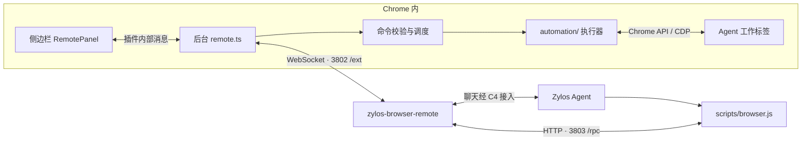

# 开发指南

[← 返回项目首页](../README.md)

本文说明插件的架构、执行链路、源码位置和本地验证方式。安装与连接步骤见项目首页的[快速开始](../README.md#quick-start)。

## 1. 本仓库与其他项目的分工

| 项目                          | 运行在哪里                  | 职责                                                                   |
| ----------------------------- | --------------------------- | ---------------------------------------------------------------------- |
| `zylos-browser-extension`     | 用户的 Chrome 内            | 侧边栏、工作标签、浏览器操作、工具定义/指南、参数校验和结果返回        |
| `zylos-browser-remote`        | 本机或服务器的 Node.js 进程 | Relay 通用转发、CLI 入口、图片附件处理与消息投递；Skill 只说明传输用法 |
| `zylos-core` / Zylos 运行目录 | 本机或服务器                | C4 消息通道和 Agent 运行环境，由模型决定调用哪些动作                   |

Remote 是插件当前使用的连接方式，可以连接本机或服务器上的 Relay。
浏览器操作引擎在本仓库的 `utils/automation/`。

### 当前默认链路：插件任务循环

Remote 握手返回 `agent-loop-v1` 后，每条侧栏消息由 `utils/browser-loop.ts` 管理。
首轮只附当前页面摘要和两个入口动作，普通聊天无需整份工具目录。需要浏览器时先选择
当前页或打开指定网址；插件执行并读取状态后，下一轮自动附完整动作规则和参数。

`utils/browser-round.ts` 执行模型的一批已知动作，处理加载、任务新 Tab 和观察。
允许最多五个动作，只有已有引用的表单编辑能放在后续动作之前；点击、导航、读取和滚动
结束一批。整批参数先校验，页面变化或错误中止后续动作。输入只执行一次，变化中的只读
快照最多尝试三次。默认传有界文本、视口/滚动信息、任务标签和实际动作结果，不传截图；
视觉任务才请求 observe。新 Tab 来源取自 webNavigation 的导航事件，避免前台切换影响归属。

Remote 将首次 `agent-request` 经 C4 送到远端 Agent。Agent 通过 `scripts/decision.js` 提交一个
关联请求 ID 的 JSON，内容为 actions / done / blocked。它不再手工调用动作和读取状态。
插件在动作后生成下一轮状态，由 Remote 的 `/decision` 直接作为同一次 CLI 的返回值交给
Agent，无需重新入 C4 队列。最终回复保存后返回 finished，释放控制。任务进行时，外部直接浏览器 RPC
返回 LOOP_OWNS_BROWSER，旧聊天出口返回 DECISION_REQUIRED；info/describe 和停止仍可用。
Monitor 通过 `agent-event` 记录插件本地执行步骤，决策轮次不会冒充浏览器工具。

重复决策不会再次执行；停止、断线、重载后旧决策不能重新启动任务。新消息中断上一轮，
保留已打开页面，再捕获新消息的当前页面。任务最多 30 轮 / 15 分钟，单次 Agent 决策
最多等 5 分钟，连续三轮失败终止。加载稳定观察最长 8 秒，其结果不等于业务目标完成。
异步页面仍需 Agent 根据实际状态判断。最终答复和中断状态保存于插件聊天记录。

浏览器协议与规则见 [decision-guide.md](../agent/decision-guide.md)。Remote 仅转发、处理
关联和图片附件；zylos-core 无需改动。C4 排队和 Agent 推理成本仍存在，本地测试不证明
线上任务提速比例。升级需更新并重启 Remote、重载插件（新增 webNavigation 权限）。

下文 `describe` / CLI / `step` 的说明属于保留的直接 RPC 接口；连接旧 Remote 时仍使用它。

工具的唯一来源也在本插件：`utils/tool-catalog.ts` 使用执行时的 Zod 参数规则生成描述，
并为每个方法维护用途、约束与例子；`agent/browser-guide.md` 保存浏览器工作流程与错误恢复。
`describe` 无须启动浏览器任务，返回精简工具目录和指南；`describe method=<name>` 或
`describe methods=[...]` 返回选定工具的完整参数描述。添加方法却缺少说明时，类型检查会失败。
这样 Agent 总是读取当前连接的插件版本，不需要服务器持有本仓库或维护另一份工具清单。



上图展示本地联调的端口。**3802 和 3803 都由 Relay 监听。** 插件主动连接 `ws://127.0.0.1:3802/ext`；
Agent 的命令入口访问 `http://127.0.0.1:3803/rpc`。
聊天与工具请求共用插件到 Relay 的 WebSocket，根据消息的 `type` 分流。

### 浏览器状态与聊天状态

Agent 的最终回复和进度回复通过 `components/MarkdownMessage.tsx` 渲染 CommonMark / GFM，
支持标题、强调、引用、列表、表格、链接、代码块、任务列表和脚注。历史消息仍保存原始文本，
重新打开侧栏时自动渲染，无需迁移。用户输入与系统提示保留原文。
渲染器随插件打包；不执行原始 HTML，也不允许脚本或本机文件链接。外部网页链接在新标签打开，
表格与代码块可在侧栏内横向滚动，脚注跳转不会改变插件 URL。Remote 不需要配套修改。

聊天中会在首个浏览器调用处插入折叠的进度条，默认只显示当前状态和主要阶段数量。
点击展开主要步骤；再展开“详细日志”才会显示每次工具调用、简短目标、排队/执行/结果、错误码和耗时。
收到最终回复后再次自动收起。进度消息和 `finish` 不提前结束整轮记录，空档显示“等待 Agent 下一步”，不推测模型是否在思考。

`utils/tool-progress.ts` 从原始事件推导展示内容：

- 成功的 `info`、`describe`、`tabs`、`frames` 及结束/清理命令默认收进日志。
- 连续读取合并为一个阶段；同一页进入操作阶段后，反复读取、定位、点击、输入、滚动等合并展示。
- 打开、切换和导航保留独立阶段；小于 2 秒的普通等待不单列，持续等待到 2 秒时更新状态。
- 错误和执行结果未确认的事件保留为可见异常；不会因为后面出现无关成功就清除。
- 只有同一任务/Tab/URL、相同工具及完整参数的实际重试成功，才标记先前失败已恢复。导航、换页、后台重启或缺少上下文时不猜测恢复。
- 重试比对数据仅存在后台内存。历史保留原始错误和 `recovered` 标记，恢复统计不会因日志裁剪丢失。主进度和浮动预览的完成状态都参考未恢复异常。

记录由 `utils/tool-activity.ts` 在插件本地生成，`components/ToolSteps.tsx` 负责展示；不增加 Agent 调用，
不需要升级 Remote。它展示已收到的浏览器请求，不预测未来动作，也不包含 Agent 服务器上的 Shell 等工具。
聊天外的独立 `info` / `describe` 探测不产生任务记录。重试复用结果仍留在日志，但不重复计入主要阶段。
步骤随聊天保存在 `remoteChatLog`，清空聊天会一起删除。只保存名称、目标提示、状态、错误码、恢复标记和时间，
不复制表单输入、完整参数、页面输出或截图 Base64。单轮保留最近 200 次调用，整个聊天保留最近 2,000 次；
超过上限保留数量、失败及恢复统计；主列表标为最近阶段，详细日志说明省略数量。旧记录无需迁移，缺少恢复证据的失败仍提示确认。

手动停止显示已停止；断线或后台重启会把未确认的执行标为结果未确认。输入框右上方的浮动画面提供查看和停止。
普通聊天不生成空步骤条或预览。

正常流程是「用户发消息 → Agent 调用工具 → Agent 最终回答 → 本轮结束」。
普通聊天回答默认为最终回答：插件收到后立即撤销浏览器控制，收起主要步骤并冻结任务预览，
清除模拟鼠标、调试连接和工作标签组，保留已经打开的页面（例如正在播放的视频）。无需再调用 `finish`。
旧的排队指令会被取消；下一轮浏览器操作创建新的任务。

### 一次调用完成动作与结果读取

`step` 在插件内按顺序执行一个动作、可选的条件等待、一次读取。它占用一个队列位置，
中间不会插入其他普通调用；停止、暂停和对话框处理仍可打断或绕过等待。
参数定义在 `utils/action-step.ts`，调度复用 `utils/remote-commands.ts` 和原有执行器的校验与页面权限。
只允许一个动作，不能嵌套 `step`、再写入第二次或执行任意脚本。所有参数在动作前整体校验。

```json
{
  "action": { "op": "open", "url": "https://example.com/" },
  "read": { "op": "snapshot", "interactive": true }
}
```

Agent 通过 `describe method=step` 获取完整参数，然后调用原有 CLI 的 `step '<JSON>'`。
`open/new-tab/back/forward/reload` 默认增加最长 10 秒的加载等待。
链接点击或 Enter 提交预期跳转时，使用 `wait:{"condition":"navigation"}`，不需要目标 URL。
插件在发送输入前记录当前标签、任务和导航版本，只有真正发生导航且加载完成才返回实际地址。
支持延迟跳转、重定向、同标签 SPA 地址变化和同 URL 刷新；旧页已加载、子框架加载不会满足该条件。
该条件仅用于 `step` 的 click/keypress，不能单独调用，也不代表网站异步内容或业务目标已经就绪。
页内更新使用已观察到的元素状态或正文条件；禁止给交互传 `loaded`，避免旧页已加载造成误判。
未指定等待时，动作明确返回 `navigating:true` 会自动补加载等待，其余交互立即读取当前状态。
不得编造目标网址、内容 ID 或选择器；仅在已知完整地址且确实需要精确校验时使用 URL 等待。
新窗口的选择仍分开处理。
各阶段共用 RPC 的绝对截止时间，CLI `--timeout` 应覆盖动作、等待及读取的总预算。

成功返回 `completed:true` 和顺序 `steps`，表示这些阶段已执行，业务结果仍由 Agent 根据读取内容判断。
失败返回 `STEP_INCOMPLETE`，`details.steps` 区分 `success/error/skipped`，不回滚、不自动重做动作。
等待或读取失败后应单独继续等待/读取，不要用新的 CLI 调用重跑整个组合。
同一 requestId 在当前 worker 的缓存中复用执行回执，部分失败也缓存。缓存只保留阶段回执，
成功读取的快照/图片以 `omittedFromReplay:true` 替代，防止积累大图片或把历史观察当成新状态。
重连、worker 重启或缓存淘汰后仍应先观察再决定是否重试。

聊天进度实时记录内部已执行阶段；Remote Monitor 在请求返回后可展开内部成功、失败和未执行项，
浏览器 RPC 统计仍计为一次。Remote 只增加监控展示及嵌套输入脱敏，不增加执行逻辑；旧 Relay 也可转发。
独立 Chrome 对比验证调用数从 3 次变为 1 次，同一次采样纯执行耗时分别为 206/241 ms，
不含真实 Agent 推理，不能用作整体提速结论。覆盖延迟导航、填写后读取、部分失败、去重及暂停取消。

### 通用完成条件与停止规则

`agent/browser-guide.md` 要求 Agent 明确每个请求结果及其确认依据，跟踪尚未完成、已确认或受阻的部分。
覆盖打开页面、搜索、阅读/提取/比较、填写表单、提交/保存、设置/选择和播放等任务。
每次调用都应推进一个未完成目标或解决具体不确定性；已确认的结果只在相关页面变化或证据冲突后复查。
优先复用已有证据，采用针对性读取。字段值正确不等于提交或保存成功，需检查对应的网站确认或结果状态。
切换按钮先读状态，不能用再次点击来验证；所有目标确认完成就回复，不继续关闭无关浮层或反复截图。
失败后先做一次针对性读取，只有新证据表明目标尚未达成且重试有帮助时才重试；无法确认就如实说明。
这些是提供给 Agent 的执行指导，不是插件按固定点击次数强制中止任务。

原有 `find` 的 `matches[].state` 和 `inspect` 的返回值新增 `ariaLabel`、`title`，
原生 `<video>` / `<audio>` 另有 `media`：暂停、结束、跳转、播放时间、时长、就绪/网络状态、
静音、音量、倍速和错误码。未知或无限时长返回 `null`，不返回媒体源 URL，不操作播放器。
`wait condition=text` 仍查询 DOM 文本，不能用等待“暂停”文字来确认播放。
原生播放状态只是当前观测；必要时比较两次播放时间确认推进，还需确认是目标内容而非广告。
自定义播放器、播放器未加载或内容无法确认时仍需针对性检查，不能猜测成功。

2026-09-17 本地 Monitor 中“打开 YouTube、搜索蜘蛛侠、播放”的修复前记录：
总耗时 92.750 秒，11 次浏览器调用、其中 2 次点击；最后一次点击约在第 67.7 秒，
之后又约 25 秒才结束。收尾包含等待正文“暂停”的 8 秒超时及一次快照。
这说明存在错误的确认条件和额外往返，并不证明该次任务发生大量重复点击。
独立 Chrome 测试覆盖读取实际播放状态、仅一次播放点击，以及最终回复释放控制后继续播放；
它没有运行真实 Agent，不能当作修复后相同任务耗时的基准。

插件支持最终回复回执 `chat-ack-v1`。搭配 Browser Remote 0.3.0 或更新版本，
插件离线时 Agent 仍可提交最终回复，由 Relay 保存，重连后补送并结束任务。
插件保存回复后确认；同一回复重送不会重复显示，也不会再次结束任务。
清空聊天记录仍保留最近 500 个回复确认 ID。双方都需要升级，旧插件不能确认待发送回复。
截图过程最多等待 12 秒，超时会返回阶段信息，不会自动重做之前的点击等操作。

需要在操作过程中说明进度时，Agent 必须显式发送 `final:false`，例如用 Browser Remote 的
`scripts/send.js --progress <keyId> <text>`；这种消息保留任务，侧栏继续等待最终回答。
执行期间卡片区分正在操作、待命和暂停。`pause` / `finish` 可暂时释放调试连接；
需要在最终回答前关闭临时页面、仅保留部分结果时，可选用 `finalize keep=[...]`。

发送聊天后，侧栏单独显示等待回复；收到 Relay 的 C4 入队回执后显示「消息已进入队列」。
投递失败或 Agent 暂时不可用的提示保留在对应用户消息下方，重新打开侧栏仍可查看。
两分钟没有新回复或工具进度时会显示等待提示；有排队/执行中的浏览器步骤时显示实时进度。
这个计时只影响提示文案，不取消任务、不禁用发送，也不会阻止迟到的回复。插件不会自动重发聊天或重复浏览器操作。
排查无回复时，需分别检查 Relay 是否接收、C4 是否入队、Agent 是否回复。

### 浮动实时预览

输入框右上方显示 240 × 166 的任务画面；悬停、键盘聚焦或触屏时显示“查看 / 停止”。
完成后保留最后画面并显示绿色勾选。手动停止、连接中断、最后一个未恢复的操作错误分别显示对应状态，晚到的最终回复不会把已停止/中断的任务改成成功。
“已完成”表示浏览器执行链路已结束，不代表插件独立验证了 Agent 的业务结论。

`utils/automation/live-preview.ts` 复用执行器已附着的 Chrome 调试连接，通过
`Page.startScreencast` 接收连续 JPEG 帧，不轮询截图，也不创建新的浏览器控制会话。
`components/LivePreview.tsx` 在输入框上方呈现画面；`utils/live-preview.ts` 定义只供侧栏使用的消息结构。

- 只采集 Agent 的目标 Tab；用户激活别的 Tab 不改变目标。查看按钮激活原 Tab，关闭后不会重新打开它。
- 仅可信侧栏通过 `live-page-preview` port 订阅，且至少一个侧栏可见时才开始采集；关闭/隐藏侧栏、暂停或结束任务时停止。
- 画面最长边受 640 × 360 限制、JPEG quality 55，向侧栏每秒最多推送 10 次；每个侧栏最多一帧等待确认，慢消费者不会积压帧。
- 帧和最后画面只在插件内存与侧栏之间流转，不进入 `RemoteState`、聊天存储、RPC 返回、Remote 或 Agent 上下文。Remote 不需要配套升级，也不新增扩展权限。
- 实际更新由 Chrome 页面绘制决定；静止页面不会固定频率刷新。画面无法采集时明确提示，查看和停止仍可用。
- 保留的画面在清空对话、开始新目标或插件后台重启后清除；不写入磁盘。

端到端测试用独立 Chrome profile、真实本地动画页面和现有 Relay 验证连续帧、后台 Tab、380/320 宽度、悬停/键盘按钮、任务完成冻结、查看原页及关闭原页。
`E2E_SCREENSHOT_DIR=/tmp/zylos-live-preview npm run test:e2e` 可保存真实运行截图。
单元测试另外覆盖侧栏隐藏/断开、帧确认与背压、切换/导航、采集失败、断线及停止后的晚到回复。

## 2. 目录地图

```text
zylos-browser-extension/
├── entrypoints/                    WXT 识别的两个插件入口
│   ├── background/
│   │   ├── index.ts                后台启动入口
│   │   └── remote.ts               连接、聊天、状态通知、命令接收
│   └── sidepanel/
│       ├── index.html              侧边栏页面外壳
│       └── main.tsx                挂载 React 界面并导入样式
├── components/
│   ├── RemotePanel.tsx             界面状态、页面切换和后台请求
│   ├── Brand.tsx                   欢迎页和助手头像的章鱼图案
│   ├── Conversation.tsx            欢迎页、聊天记录、浏览器任务卡片
│   ├── ChatComposer.tsx            输入框、发送状态、中文输入与快捷键
│   ├── ConnectionSettings.tsx      连接配置、启停插件与清空聊天
│   ├── LanguageProvider.tsx        语言偏好、即时切换与跨侧栏同步
│   └── ErrorBoundary.tsx           界面出错时显示兜底信息
├── assets/
│   ├── design-tokens.css           设计变量入口：字体、间距、布局与 DaisyUI 主题
│   ├── styles.css                  Tailwind / DaisyUI 入口与侧边栏布局样式
│   └── brand/                      Figma 原始 Logo、发送图标和共享色板
│       └── palette.css             侧栏与网页鼠标共同使用的品牌颜色
├── locales/
│   ├── zh-CN.ts                    中文界面文案
│   └── en.ts                       英文界面文案（与中文键名一致）
├── public/
│   ├── icons/                      16 / 32 / 48 / 128px 章鱼插件图标
│   └── _locales/                   Chrome 扩展描述和工具栏提示的中英文
├── utils/
│   ├── i18n.ts                     语言解析、翻译、日期与错误提示格式化
│   ├── remote.ts                   连接配置、消息格式、界面状态和存储键名
│   ├── remote-commands.ts          Agent 请求调度、排队、停止打断和去重
│   ├── tool-catalog.ts             工具目录、参数描述与 describe 响应
│   ├── commands.ts                 浏览器动作参数定义
│   ├── action-step.ts              单动作、条件等待与结果读取的组合参数及回执
│   ├── messages.ts                 只接受本插件侧边栏发来的内部请求
│   ├── guard.ts                    受限网址判断
│   └── automation/                浏览器操作实现
│       ├── executor.ts            工作标签、调试连接、导航、弹窗、等待和总调度
│       ├── page-actions.ts        元素定位、快照、控件状态和具体操作
│       ├── frames.ts              iframe 和子调试会话管理
│       ├── pointer-motion.ts      鼠标移动轨迹、点击前命中检查
│       ├── cursor.ts              生成可视光标的更新脚本
│       ├── task-lifecycle.ts      工作标签归属记录、清理和异常恢复
│       ├── types.ts               执行器的数据类型
│       └── injected/              按需在网页中执行的固定辅助函数
│           ├── dom-action.js      元素状态、焦点、表单和容器滚动
│           ├── page-query.js      CSS 查找、文本查询、Shadow DOM 遍历
│           └── cursor.js          绘制 Agent 的页面光标
├── tests/
│   ├── unit/                      参数、连接、执行器、鼠标、任务清理等测试
│   ├── fixtures/commands.cases.json  命令参数与默认值样例
│   ├── project-structure.test.ts   插件入口结构检查
│   ├── build.test.mjs             manifest、资源和产物检查
│   └── e2e/browser-actions.mjs     真实 Chrome + Relay 的端到端测试
├── agent/
│   └── browser-guide.md            随插件提供的 Agent 操作指南
├── docs/
│   ├── DEVELOPMENT.md              架构、目录地图与开发指南
│   └── BROWSER-ACTIONS.md          动作参数、实现步骤和验证记录
├── wxt.config.ts                  插件配置及 Tailwind 的 Vite 插件
├── package.json                   依赖、版本与 npm 命令
├── package-lock.json              依赖锁文件
├── tsconfig.json                  TypeScript 配置
├── vitest.config.ts               测试配置
├── .wxt/                          WXT 自动生成的类型与配置
├── .output/chrome-mv3/             Chrome 实际加载的构建产物
└── node_modules/                  npm 安装的依赖
```

修改功能时编辑源码，再运行构建。`.output/` 和 `.wxt/` 由 WXT 生成，手动修改会被下一次构建覆盖。
WXT 是插件开发框架，React 负责界面，TypeScript 用于代码检查，Zod 用于运行时校验消息和参数。

## 3. 两个入口如何启动

### 侧边栏入口

[sidepanel/main.tsx](../entrypoints/sidepanel/main.tsx) 直接把
[RemotePanel](../components/RemotePanel.tsx) 挂载到页面上，套上错误兜底组件并导入样式。
界面组件负责显示状态、接收输入、向后台发请求。

侧栏已按 [Figma 四种状态](https://www.figma.com/design/qEYh0ltFkLaL0Wj7rW5Qll/zylos-extension?node-id=5-75)
实现欢迎页、日常对话、浏览器任务卡片和独立的连接设置页。页头和底部输入区固定，
聊天区单独滚动，适配 320–480px 侧栏；短窗口中的设置页可以滚动。
示例任务只填入输入框，由用户发送；Enter 发送、Shift + Enter 换行，中文输入法确认文字不会误发。
发送失败保留草稿，阅读旧消息时新回复不会强行把页面拉到底部。
浮动预览使用后台真实任务及其目标标签页，查看与停止按钮直接调用本地功能。

例如，发送聊天用 `remote-chat-send`，保存设置用 `remote-save`，停止任务用 `remote-stop`。
这些请求通过 `chrome.runtime.sendMessage` 在插件内部传递。
[messages.ts](../utils/messages.ts) 检查请求来源必须是本插件的 `sidepanel.html`。

### 后台入口

[background/index.ts](../entrypoints/background/index.ts) 调用
[startRemoteBackground()](../entrypoints/background/remote.ts)，完成以下初始化：

1. 注册执行器和 Chrome 事件监听。
2. 处理任务清理记录，读取本地设置和聊天记录。
3. 用 Relay 地址与 key 建立 WebSocket，处理心跳和断线重连。
4. 接收侧边栏请求和 Relay 消息，把最新状态通知界面。
5. 设置工具栏按钮行为：点击插件图标打开侧边栏。

后台是 Chrome 管理的 Manifest V3 Service Worker。关闭侧边栏只关闭界面，连接和执行逻辑由后台管理。
Chrome 可能回收后台，因此代码会保存配置与清理记录；元素引用和在途操作不能跨后台重启继续使用。

| 数据                         | 保存位置                                  |
| ---------------------------- | ----------------------------------------- |
| Relay 地址、key、启用状态    | `chrome.storage.local` 的 `remoteConfig`  |
| 最近 200 条聊天记录          | `chrome.storage.local` 的 `remoteChatLog` |
| 工作标签归属及清理记录       | `chrome.storage.local` 的 `taskCleanupV1` |
| 当前连接、动作队列、元素 ref | 后台内存                                  |

## 4. 一条聊天、一次点击经过哪些文件

### 聊天流程

1. 你在 `RemotePanel.tsx` 输入文字，界面发送内部消息 `remote-chat-send`。
2. 侧栏捕获所在窗口的激活标签，后台 `utils/page-context.ts` 读取最多 6,000 字符的主页面文字（2.5 秒读取预算），生成当前页上下文；表单值不包含在自动摘要内。
3. 后台 `remote.ts` 将它封装为 `{type:"chat", id, text, ts, context}`，经 WebSocket 送到 Relay。`text` 保留用户原文；`context` 是插件生成、最多 16,000 字符的 JSON 字符串。
4. Relay 仅校验上下文长度与类型，将原文和上下文交给 C4，Agent 收到任务。
5. Agent 回复经 C4 发送脚本和 Relay 的 `/chat` 接口返回插件。
6. 后台收到 `type:"chat"` 后保存记录并通知侧边栏显示。

### 点击流程

1. Agent 经 Remote 调用插件的 `describe`，读取本插件的指南和参数定义，再通过 `scripts/browser.js` 提交 `click` 和参数。
2. Relay 的 `3803 /rpc` 接口接收请求，通过 WebSocket 发给插件，消息类型为 `req`。
3. 后台 `remote.ts` 将请求交给 [remote-commands.ts](../utils/remote-commands.ts)，检查方法、参数、请求队列和重复 ID。
4. [executor.ts](../utils/automation/executor.ts) 确认工作标签和调试连接，再调用 [page-actions.ts](../utils/automation/page-actions.ts)。
5. 页面执行层解析元素引用，移动鼠标并点击，通过 Chrome API 读取操作结果。
6. 结果以 `resp` 或 `error` 原路返回 Agent，由 Agent 判断下一步。

`remote-chat-send` 是插件内部消息，`req` 是网络消息类型，`click` 是浏览器动作名。
这三个名称对应不同层次，分别解决界面通信、网络分流和动作执行的问题。

### CDP 指令从哪里产生

**Agent 选择动作，插件产生具体 CDP 调用。**
例如 `click` 最终使用 `Input.dispatchMouseEvent`，文字输入使用 `Input.insertText`，截图使用 `Page.captureScreenshot`。
CDP 是 Chrome DevTools Protocol，即 Chrome 的浏览器调试协议；插件通过 `chrome.debugger.sendCommand` 调用它。

标签创建和分组使用 `chrome.tabs`、`chrome.tabGroups`；页面查找、状态读取、原生下拉框等操作还会执行内置 DOM 辅助函数。
当前链路不需要额外安装 `agent-browser`，也不需要为日常使用开启 Chrome 远程调试端口。

## 5. 浏览器执行器的内部职责

| 文件                                                               | 主要职责                                                                            |
| ------------------------------------------------------------------ | ----------------------------------------------------------------------------------- |
| [commands.ts](../utils/commands.ts)                                | 定义每个动作的合法参数，例如点击必须提供 ref 或成对坐标                             |
| [remote-commands.ts](../utils/remote-commands.ts)                  | 暴露 Agent 方法、声明能力、调度动作、去重、处理停止打断                             |
| [executor.ts](../utils/automation/executor.ts)                     | 创建任务、选定工作标签、连接 debugger、导航、处理原生弹窗、等待条件、截图和结束任务 |
| [page-actions.ts](../utils/automation/page-actions.ts)             | 快照、CSS 查找、控件状态、点击、拖拽、输入、组合键、选择和滚动                      |
| [frames.ts](../utils/automation/frames.ts)                         | 管理 iframe 树与跨进程子调试会话                                                    |
| [pointer-motion.ts](../utils/automation/pointer-motion.ts)         | 鼠标轨迹、视口坐标校验、移动前后目标检查                                            |
| [cursor.ts](../utils/automation/cursor.ts) 和 `injected/cursor.js` | 在页面中绘制 Agent 的操作光标                                                       |
| [task-lifecycle.ts](../utils/automation/task-lifecycle.ts)         | 记录任务拥有的标签、保留决定、清理结果与异常恢复依据                                |

### 元素引用与复杂页面

`find` 根据 CSS 选择器查找元素；`snapshot` 读取 Chrome 的可访问性树（AX tree），将按钮、输入框等整理成文字结果。
它们会分配类似 `@a1b2c3d4-e7` 的 ref。Agent 使用这个临时引用操作元素，插件内部记录对应节点、frame 和页面代次。
导航后需要重新 `find` 或 `snapshot`，旧 ref 会失效。

iframe 是页面中嵌套的另一份文档。`frames.ts` 管理其调试会话，`page-actions.ts` 处理定位与坐标换算。
Shadow DOM 是网页组件内部的 DOM 子树；CSS 查询会遍历 open Shadow DOM，closed root 中暴露到 AX 树的元素可以用快照 ref 操作。

`injected/` 内是插件自带的固定函数，以 `?raw` 方式打包，按需在元素所属页面环境中执行。
这里没有对 Agent 开放任意 JavaScript 的执行入口。

### 当前页上下文与原页操作

`utils/page-context.ts` 在每次消息发送时记录准确的 tab/window/URL 与可取得的文档 loaderId。
Agent 使用该消息的 `contextId` 调用 `use-current-tab`，再调用原有 snapshot/find/click 等工具。
上下文保存在后台内存中，最多 20 条，30 分钟过期；重启后台、停止控制或修改连接配置后需要重新发送消息。
切换前台标签不改变目标；原页关闭、移到其他窗口或导航后拒绝旧上下文，禁止自动另开 URL 代替。
页面摘要是非可信内容；任务意图来自用户消息，具体选页规则由插件的 Agent 指南提供。

原标签以 borrowed/owned=false 加入任务，不导航、不分组；停止、finalize、最终回复和恢复清理均保留它及其原分组。
任务新建的标签仍有独立归属和清理逻辑。自动读取使用短暂的只读调试连接，已有执行器连接时复用，
不会创建操作任务；无法读取时仍发送聊天和不可用说明。截断标志提醒 Agent 必要时读取更多内容。

### 工作标签的生命周期

首次 `open` 调用 `createTask()`，在来源窗口中创建新工作标签并分组。当前任务最多包含 8 个工作标签，
网页从任务标签打开的新页也需要经过归属检查才能加入。后续命令针对选定的工作标签，用户切换前台页不会改变目标。

| 操作                  | 行为                                                             |
| --------------------- | ---------------------------------------------------------------- |
| `pause` / `finish`    | 释放调试连接，保留任务与标签；后续动作可恢复，长期闲置会自动释放 |
| `stop` / 侧边栏“停止” | 撤销控制，并按归属记录清理任务临时标签                           |
| `finalize`            | 结束任务、清理临时标签；用 `keep` 指定要保留的结果页             |

清理前仍会核验标签的窗口、分组和归属；用户移走的标签会交还用户。
具体动作参数和限制见 [BROWSER-ACTIONS.md](../docs/BROWSER-ACTIONS.md)。

## 6. 修改功能时看哪里

| 想修改的内容                         | 优先查看                                                     |
| ------------------------------------ | ------------------------------------------------------------ |
| 聊天气泡、设置、按钮和状态布局       | `components/`                                                |
| 中英文界面文案                       | `locales/zh-CN.ts`、`locales/en.ts`                          |
| 品牌色、字体、间距和布局变量         | `assets/design-tokens.css`                                   |
| 侧边栏样式、Tailwind 扫描范围        | `assets/styles.css`                                          |
| 保存配置、聊天收发、连接和重连       | `entrypoints/background/remote.ts`、`utils/remote.ts`        |
| 动作名称、参数、能力、排队与去重     | `utils/commands.ts`、`utils/remote-commands.ts`              |
| 鼠标、键盘、表单、元素状态、容器滚动 | `utils/automation/page-actions.ts`、`injected/dom-action.js` |
| CSS 查找、Shadow DOM 遍历            | `utils/automation/injected/page-query.js`、`page-actions.ts` |
| iframe、跨文档定位和坐标             | `utils/automation/frames.ts`、`page-actions.ts`              |
| 导航、等待、原生弹窗、新标签接续     | `utils/automation/executor.ts`                               |
| 工作标签清理与保留                   | `utils/automation/task-lifecycle.ts`                         |
| 插件名称、权限、版本                 | `wxt.config.ts`、`package.json`                              |
| 让 Agent 学会使用新命令              | `utils/tool-catalog.ts`、`agent/browser-guide.md`            |

新增普通动作的顺序是：在本插件定义参数 → 确认方法与调度策略 → 实现执行逻辑 → 在本插件补充工具说明和测试。
Relay 的 `/rpc` 通用转发方法名与参数；工具描述通过 `describe` 随插件一起提供，新增普通浏览器动作无需同步 Remote 的 Skill 或工具列表。

第一次读代码推荐顺序：`sidepanel/main.tsx` → `RemotePanel.tsx` → 后台 `remote.ts` →
`remote-commands.ts` → `executor.ts` → `page-actions.ts`。

### 界面设计变量与 DaisyUI

[design-tokens.css](../assets/design-tokens.css) 是设计变量入口文件，对应
[Figma 视觉规范](https://www.figma.com/design/qEYh0ltFkLaL0Wj7rW5Qll/zylos-extension?node-id=4-68)。
原始色板在 [brand/palette.css](../assets/brand/palette.css)，由变量入口引入。
间距、圆角、布局、字体和 DaisyUI 主题都在变量入口中分段维护，并有中文注释：

- 品牌主色 `#AC01C2`；正文 `#211A25`；辅助文字 `#706776`。
- 中英文统一使用浏览器 / 系统默认界面字体（`system-ui, sans-serif`），正文 14/22，辅助文字 12/18。
- 4px 间距体系；控件 / 卡片 / 消息圆角分别为 8 / 12 / 16px。
- 布局目标：侧栏基准 380px、范围 320–480px、页头 64px、左右留白 16px。

已接入 **Tailwind CSS 4 + `@tailwindcss/vite` + DaisyUI 5**，随插件构建打包。
侧边栏的 `data-theme="zylos"` 使用本文件的浅色主题；不启用内置主题或自动深色模式。
Tailwind 只扫描 `components/` 和 `entrypoints/sidepanel/`，不会把浏览器执行脚本或测试内容当作界面工具类。

普通 CSS 可以直接引用变量：

```css
.live-preview {
  padding: var(--zylos-space-16);
  border-radius: var(--radius-card);
  background: var(--color-primary-soft);
  color: var(--color-base-content);
}
```

React 可以直接使用 DaisyUI 和 Tailwind 类名，无需额外的 React 包装库：

```tsx
<button className="btn btn-primary min-h-11 text-label">发送</button>
<div className="rounded-card bg-primary-soft p-4 text-body">任务内容</div>
```

页面使用 DaisyUI 按钮、输入框和卡片，并按 Figma 细化布局。DaisyUI 的组件样式位于
`utilities.daisyui`，页面定制样式位于其后的 `utilities.zylos`，Tailwind 工具类仍能覆盖两者。
Logo 和发送图标从 Figma 原样导出并随插件打包，不依赖远程图片地址。
字体由浏览器根据操作系统选择，不打包或远程加载字体文件。
Figma 中的字体仅作排版示意，实际字形以用户系统为准。

网页内的 **鼠标箭头、操作标签、点击光圈、目标元素描边** 统一使用品牌紫色 `#AC01C2`。
[cursor.ts](../utils/automation/cursor.ts) 将共享色板与光标脚本一起注入隔离环境，
[cursor.js](../utils/automation/injected/cursor.js) 在 Shadow DOM 中使用这些变量。
改品牌色只需改色板；不需要在鼠标实现里再维护一组颜色。光标不拦截页面点击，
仍会在任务结束或长时间无操作后自动清理。
配置参考：[DaisyUI 自定义主题](https://daisyui.com/docs/themes/)、
[Tailwind Vite 接入](https://tailwindcss.com/docs/installation/using-vite)。

### 界面语言与插件图标

默认跟随浏览器界面语言：中文浏览器（含 `zh-CN`、`zh-TW`、`zh-HK`）显示中文，
其余显示英文。设置页的「界面语言 / Interface language」提供「跟随浏览器 / 中文 / English」，
选择后立即生效，保存到 `chrome.storage.local.uiLanguage`，重新打开仍保留，并同步其他侧栏。
鼠标操作标签也使用这项偏好，切换语言不重连 Relay。工作标签组标题统一为 `zylos`。
聊天记录、Agent 回复、草稿和网页标题保留原文。

新增界面文案时，在 `locales/zh-CN.ts` 和 `locales/en.ts` 添加相同键名，组件通过
`useI18n().t(...)` 读取；动态数量使用 `{count}`。日期按界面语言格式化。
插件产生的连接与表单错误通过 `ui.error.*` 错误码在界面翻译，Relay 自定义诊断保留原文。
无需额外的多语言依赖。

侧栏顶部已去掉品牌 Logo，只保留连接状态和设置入口。欢迎页和助手头像继续使用章鱼图案。
Chrome 工具栏与扩展管理页的图标来自 [Figma 图标原稿](https://www.figma.com/design/qEYh0ltFkLaL0Wj7rW5Qll/zylos-extension?node-id=9-111)，
原样导出到 `public/icons/`，通过 `wxt.config.ts` 的 `icons` 与 `action.default_icon` 引用。
扩展描述与工具栏提示由 `public/_locales/` 按 Chrome 自身语言设置选择。

## 7. 本地启动与构建

要求 Chrome 125+、Node.js 22+。完整聊天链路还需要已初始化的 Zylos 运行目录、PM2、tmux 和 Agent。
如果你使用包含 `Browser-dev.sh` 的 Coco 开发工作区，可在其根目录运行以下命令。
该脚本不在本仓库中；独立克隆本仓库时，直接使用下方的单独构建命令，并按 Remote 的 README 配置 Relay。

```text
Coco 工作区（可选）
├── Browser-dev.sh
├── zylos-browser-extension/
├── zylos-browser-remote/
└── zylos-core/
```

启动完整本地链路：

```sh
./Browser-dev.sh
```

脚本检查依赖、构建插件、接入通道，启动缺少的 C4 / Agent 监控服务，并启动或复用 Relay。
终端会显示插件目录、Relay 地址和完整 key。

1. Chrome 打开 `chrome://extensions`，开启开发者模式。
2. 加载本仓库的 `.output/chrome-mv3`；已加载过则点击扩展条目的刷新按钮。
3. 点击工具栏的 Zylos 章鱼图标打开侧边栏。
4. 在设置中填写 `ws://127.0.0.1:3802/ext` 和脚本显示的完整 key，点击“保存并连接”。

`Browser-dev.sh --check` 只检查状态，`--no-build` 复用已有构建。代码修改后需要重新构建并刷新扩展。
开发 key 默认保存在 `~/zylos/components/browser-remote/keys.local-key`，权限为 `0600`，以后固定复用并显示。
运行目录或 key 库覆盖会改变路径；设置 `BROWSER_REMOTE_KEY` 时使用环境变量。Relay 的 `keys.json` 只保存摘要。

单独构建插件时，在本仓库运行：

```sh
npm ci
npm run build
```

WXT 自动生成 `manifest.json`、`background.js`、`sidepanel.html` 和配套 JS/CSS。
`wxt.config.ts` 中的 `action` 提供工具栏按钮，后台 `setPanelBehavior({openPanelOnActionClick:true})` 指定点击后打开侧边栏。
源码中的 `sidepanel` 是 Chrome Side Panel API 的对应名称，也就是这里说的 Sidebar。

Finder 隐藏点开头的目录，可按 `Command + Shift + .` 显示，或用 `Command + Shift + G` 输入完整路径。

## 8. 常用命令与验证

| 命令                 | 用途                                      |
| -------------------- | ----------------------------------------- |
| `npm run dev`        | WXT 开发模式                              |
| `npm run build`      | 构建 Chrome 插件到 `.output/chrome-mv3`   |
| `npm run zip`        | 生成发布压缩包                            |
| `npm run typecheck`  | 生成类型并检查 TypeScript                 |
| `npm test`           | 类型检查和 Vitest 测试                    |
| `npm run test:unit`  | 单独运行 Vitest                           |
| `npm run test:build` | 构建并检查 manifest、唯一侧边栏及产物资源 |
| `npm run test:e2e`   | 构建并运行真实 Chrome 与 Relay 端到端测试 |

[test:e2e](../tests/e2e/browser-actions.mjs) 使用一次性 Chrome profile、本地网页和独立 Relay，
验证侧边栏聊天、停止按钮和浏览器动作。聊天由测试内的接收函数处理，不发送给真实 C4 或 Agent。
模型如何决定任务步骤，需要在实际 Agent 中另外联调。

```sh
CHROME_PATH="/path/to/Chrome for Testing" npm run test:e2e
```

端到端测试默认使用相邻的 `zylos-browser-remote`，可以通过 `RELAY_ROOT` 指定路径。

## 9. 继续阅读

- [BROWSER-ACTIONS.md](../docs/BROWSER-ACTIONS.md)：动作参数、实现步骤、边界和验证记录。
- [Agent 操作指南](../agent/browser-guide.md) 与 [工具目录](../utils/tool-catalog.ts)：随插件打包，通过 describe 提供给 Agent。
- [Remote 传输入口](https://github.com/zylos-ai/zylos-browser-remote/blob/main/SKILL.md)：只说明发现工具、发送请求、读取附件和回复。
- [Relay 协议](https://github.com/zylos-ai/zylos-browser-remote/blob/main/docs/PROTOCOL.md)：端口、消息格式和错误响应。
- [Relay README](https://github.com/zylos-ai/zylos-browser-remote/blob/main/README.md)：转发服务的启动、结构与 C4 接入。
