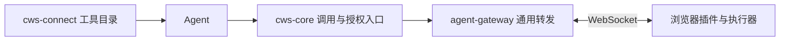

# OpenMax Connector 接入核对

核对日期：2026-09-16。通过用户 Chrome 阅读
[《OpenMax 外部资源接入架构设计（方案一）》](https://pages.opencoco.co/docs/38086bee-eafc-4f28-81e9-430ed231659f)，
页面正文标注 v1.21、待评审；随后对照本地 Extension / Remote 源码。
本记录是兼容性分析，不是已连接真实 agent-gateway 的验收结果。

## 结论与职责

浏览器执行引擎可以保留，主要工作在连接协议、身份路由和平台契约适配。
现有 Remote 已承担 HTTP → WebSocket 的轻量网关职责，但不具备文档中的平台身份与授权模型，不能直接替代平台 agent-gateway。

文档的目标调用链是：

现有 Remote 的转发代码可复用、演进或被平台网关替换；具体部署取决于平台网关的实现归属。
如果仍保留独立 Remote，只应承担有明确边界的协议适配，避免再维护一套浏览器工具表、账号鉴权和设备目录。
本地 `zylos-core` 的 C4 集成不能视为已经接入文档里的 `cws-core`。

## 一份源码，两种使用入口

当前链路由插件在决策请求中提供工具指南和参数；文档规定平台目录是运行时权威，adapter 注册时不上传工具目录。
二者并非直接兼容。建议采用以下发布流程，仍由插件仓库维护唯一源码：

1. 插件仓库维护工具参数、说明、输出约定和稳定 action 名。
2. 构建时生成平台需要的 `application_actions` 导入产物，以及双方使用的 contract revision/hash。
3. 经发布流程将产物导入平台目录；Agent 从平台发现已经发布、已经授权的工具。
4. 插件建连只注册设备身份、版本和契约版本，执行对应契约。
5. Zylos 接法由插件随决策请求提供工具契约；平台接法不能用动态描述绕过目录或 action 授权。

平台中的目录是生成和发布的副本，不再手工维护第二份定义。
**新增工具仍需要发布目录产物；只更新用户的插件，不会自动让平台 Agent 发现新工具。**

当前 `parameterSchema()` 导出的是参数形状，交叉字段约束仍在 Zod 与文字说明里。
用于平台 draft-07 契约之前，需要补齐相关约束的表达或约定执行端校验边界，并验证导出与执行语义一致。

## 差异与所需改动

| 项目        | 当前源码行为                                                           | 平台接入需要                                                                                                       |
| ----------- | ---------------------------------------------------------------------- | ------------------------------------------------------------------------------------------------------------------ |
| 工具发现    | 决策请求附带插件指南和参数                                             | 从插件源定义生成目录产物；注册携带契约版本，不上报 action 目录                                                     |
| 设备身份    | Key 摘要就是 endpoint；同 Key 新连接替换旧连接                         | 插件持久化独立 `endpoint_id`；身份与路由分离；按租户/应用等授权边界隔离，支持同 Key 多端点                         |
| 鉴权        | Remote 本地 Key 校验；Agent HTTP 入口只监听 loopback                   | 对接 cws-core 身份、connection→agent 授权、allowed_actions 和吊销传播；保持 Agent 决策入口私有                     |
| 注册        | `hello {version, capabilities}`                                        | 对齐平台 register、ack、adapter version、contract revision/hash；不兼容版本拒绝调用                                |
| 调用协议    | `/decision` + `endpoint/id/decision`；通过 WS 返回下一轮请求和结束状态 | 对齐平台 invoke/action/request_id/result 帧、namespace、超时与稳定错误格式；保留请求幂等标识                       |
| action 命名 | `open`、`click` 等；Remote method 校验不允许 `/`                       | 定义稳定的 `browser/...` action 名；在契约和适配器中明确与内部操作的映射，不凭示例把 navigate/extract 当作现成方法 |
| 图片        | 插件返回编码；CLI 写到 Agent 主机后给出路径                            | 平台受控 object reference 与上传/读取接口；持有 owner/tenant/TTL；不把网关主机路径或任意 URL 当作平台附件          |
| 聊天与完成  | 侧栏消息经 C4；最终回复 WS 帧触发插件释放控制                          | 单独对接平台消息、进度和完成事件；工具调用架构本身没有覆盖这些交互                                                 |

现有请求关联、超时、断线失败和浏览器端校验可复用。
现有 Key 吊销主要影响后续握手；平台要求还包括主动使已连接会话失效，不能把两者等同。
协议适配应将传输错误映射到平台错误类别，并保留具体浏览器错误用于恢复，避免把所有失败归为同一种错误。

## 接平台前需要明确的接口

- register / invoke / result 的正式消息结构及版本；request_id、deadline、重连后的重试语义。
- 浏览器 WebSocket 的凭据承载方式。现有插件使用 `Sec-WebSocket-Protocol`，需要与平台的请求头鉴权要求对齐。
- 平台内部 HTTP 调用如何传递已验证身份、connection 和授权版本；不能信任客户端自行声称的用户/租户字段。
- 图片对象的签发、上传、读取与过期接口，以及输出 schema/大小限制的实际配置位置。文档要求校验输出，但同时说明现有 action 表不存输出 schema。
- 侧栏消息送到哪个 Agent/会话，以及进度、最终回复如何返回插件。文档提及的《Browser Use 接入设计》可能进一步定义这些细节，本次未取得该文档。
- 同一浏览器被多个 Agent 调用时的任务隔离或独占机制。当前插件按连接维护一套控制会话，串行执行单条命令不足以防止不同任务的命令交错。

这些细节确定后，可用契约测试和真实网关联调验收：同 Key 双端点共存、跨授权拒绝、吊销在线连接、版本不匹配、离线不排队、重复请求不重复操作、图片可被 Agent 读取、聊天完成后正确释放控制。

## 代码定位

- 插件工具定义与动态说明：[tool-catalog.ts](../utils/tool-catalog.ts)、[decision-guide.md](../agent/decision-guide.md)。
- 插件连接配置与协议：[remote.ts](../utils/remote.ts)、[后台连接](../entrypoints/background/remote.ts)。
- 参数校验与幂等：[browser-actions.ts](../utils/browser-actions.ts)。
- Remote 接口与路由：[agent-lane.js](../../zylos-browser-remote/relay/agent-lane.js)、[ext-lane.js](../../zylos-browser-remote/relay/ext-lane.js)。
- Remote 本地凭据：[keys.js](../../zylos-browser-remote/relay/keys.js)。
- CLI 图片处理：[attachments.js](../../zylos-browser-remote/scripts/attachments.js)。
- 当前 C4 消息入口：[server.js](../../zylos-browser-remote/relay/server.js)。
