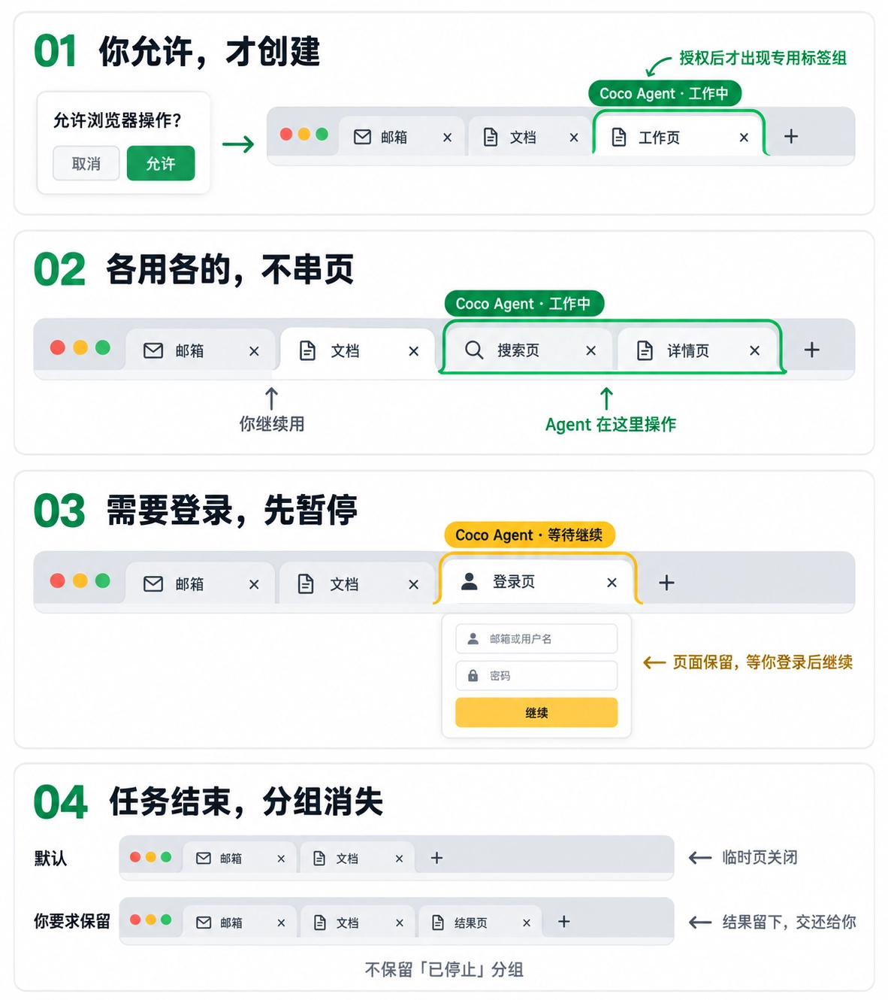
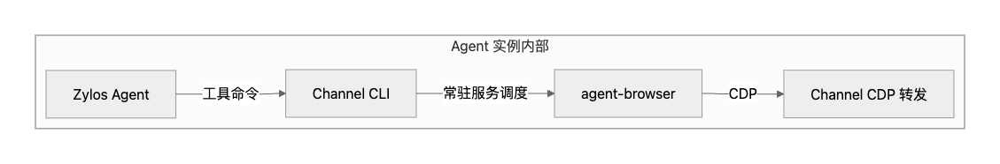
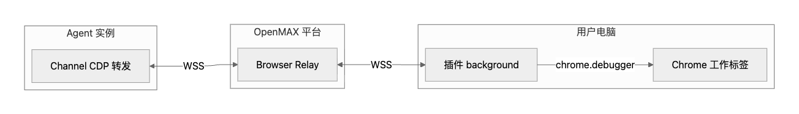
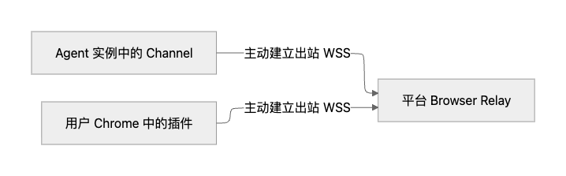
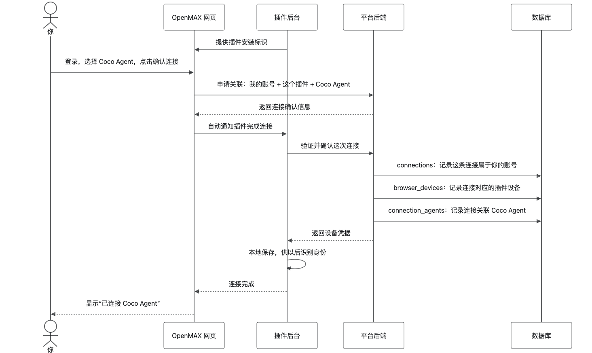
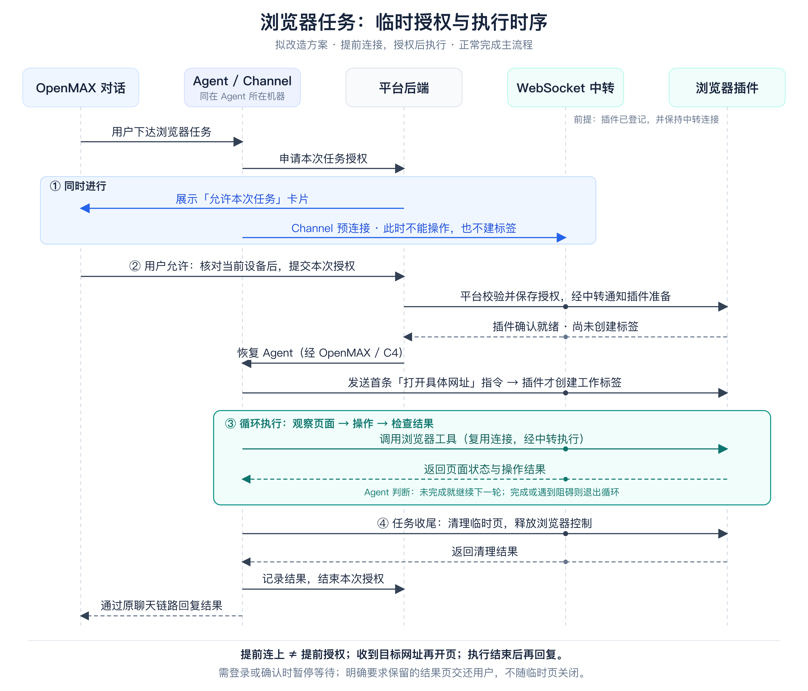

# Browser Use 插件设计方案评审

评审稿 · 2026-09-09

用户在 OpenMAX 私聊中向 Agent 下达浏览器任务，并在对话里批准本次操作。浏览器插件负责执行，平台负责绑定、授权与中转；用户无须再打开插件确认。

**核心原则：先接入，按任务授权；提前连接，获准后执行；专用标签操作，结束后交还结果。**

## 1. 功能和交互

### 1.1 首次接入

用户首次使用时，在 OpenMAX 的 Connector 页面选择“连接当前浏览器”。

1. 检测 Coco 插件是否安装；未安装时，引导前往 Chrome 应用商店，安装后返回连接。
2. 复用当前 OpenMAX 环境的网页登录；未登录时，进入现有登录／注册流程。
3. 用户在 OpenMAX 页面确认账号、工作区，选择有权使用的 Agent，点击连接。
4. 插件 background 自动完成设备登记并保存设备专用凭据，无须再次打开 Popup 确认。
5. 页面显示绑定结果及在线状态，用户可以进入所选 Agent 的私聊。

`进入 Connector → 检测／安装插件 → 复用 OpenMAX 登录 → 选择 Agent → 确认连接 → 接入完成`

绑定关系包含：**账号及工作区、当前浏览器实例、所选 Agent**。这里的浏览器实例是同一 Chrome profile 内的插件安装实例，不是整台电脑，也不是所有安装相同插件的浏览器。

首次接入只建立长期身份与通信关系，不授予任何任务的执行权限。绑定成功、浏览器在线、当前任务已获准，是三个不同状态。

[首次接入交互稿（Figma）](https://www.figma.com/board/Po6RIcheQCfoagH21e2sIF/browser-use?node-id=21-35)

### 1.2 对话中使用

用户在 OpenMAX 私聊中提出需求，例如“打开 1688，并搜索儿童玩具”。

Agent 判断需要使用浏览器后，在原对话中发起任务授权。用户点击“允许本次任务”，系统核对当前浏览器并完成准备，随后 Agent 在专用工作标签中执行。

执行不是一次性生成全部命令，而是持续按“观察页面 → 决定动作 → 操作 → 检查结果”推进。完成后清理工作区，通过原私聊返回结果；遇到阻碍则准确说明，不将失败或等待处理写成“已完成”。

`自然语言下达任务 → 对话内允许 → Agent 循环执行 → 收尾并返回结果`

任务状态和“查看工作页／继续／停止”等操作都在 OpenMAX 对话中提供。插件只需展示绑定、在线、执行或异常状态，不要求用户参与后台握手，也不承担首期聊天入口。

[任务使用交互稿（Figma）](https://www.figma.com/board/Po6RIcheQCfoagH21e2sIF/browser-use?node-id=5-23)

### 1.3 工作标签生命周期

图中“允许后创建”表示创建的前置条件；**实际收到具体网址后才创建标签，不在等待连接时先打开空白页。** 登录框表示目标网站界面，不由插件收集账号和密码。

| 阶段 | 浏览器中的行为 |
| --- | --- |
| 未授权／准备连接 | 不创建工作页，不附加调试，不读取页面或截图 |
| 开始执行 | 首条有效网址指令到来时，在原对话页旁创建工作标签并加入彩色分组 |
| 执行中 | 复用本任务的页面；用户切换标签不会改变 Agent 的操作目标，不接管用户原有页面 |
| 等待用户 | 先停止自动动作、解除调试与模拟光标，再保留“等待继续”分组；用户在网站处理后，回 OpenMAX 明确点击继续 |
| 完成／停止 | 清理临时页；明确保留的结果页退出分组、解除控制，交还用户；不保留“已停止／已完成”分组 |

模拟光标应反映真实输入动作，不遮挡人工使用，不伪装或替代 Chrome 原生调试提示。任务收尾后释放调试连接，让原生提示自然结束。

默认只关闭本任务的临时页。用户原有页面及归属不明的页面不强制关闭；新窗口或弹出页只有确认由本任务创建后，才能纳入控制与清理。

“打开结果供我查看”是否默认计入保留意图，见第 8 节待评审项；在规则定稿前，只有明确要求保留的结果页才留下。

### 1.4 首期范围

- 仅支持用户本人在 OpenMAX 私聊中发起、在当前 Chrome profile 内授权的任务。
- 不做多浏览器选择、跨设备调度、群聊共享浏览器或无人确认执行。
- 每个浏览器实例同时仅执行一个任务；不抢占已有任务，不自动转用其他设备。
- 复用现有网页登录／注册和 Agent 权限体系，不新增一套账号系统。
- 登录、验证码等人工步骤由用户在目标网站完成；不承诺绕过网站限制或支持全部站点。
- 所选 Agent 必须具备 Browser Channel 及相关工具能力；未就绪时提示配置，不将“绑定成功”视为“工具已安装”。

## 2. 整体架构

### 2.1 三条链路分开

| 链路 | 路径与职责 |
| --- | --- |
| 聊天与回复 | OpenMAX 私聊 ↔ 平台聊天 ↔ zylos-openmax ↔ C4／SQLite ↔ Zylos Agent；沿用消息投递与回复机制 |
| 绑定与任务授权 | 网页、插件、Agent 侧适配通过 cws-core 的浏览器业务接口访问 cws-connect；后者权威管理绑定、任务与授权状态 |
| 浏览器执行 | Agent 工具调用 → Browser Channel → agent-browser → CDP 转发 → 平台 Browser Relay → 插件 → Chrome 工作标签；结果沿调用链返回 |

这里的 **cws-core 是平台后端，zylos-core 是 Agent OS**，二者不是同一个组件。

普通聊天不经过 Browser Channel。实时点击、页面快照和截图不进入 C4 聊天队列；任务授权后的续跑通知仍通过 zylos-openmax 和原 C4 路径唤起 Agent。状态通知与浏览器指令不能作为新的用户聊天反复投递给模型。

### 2.2 Agent 内部工具与浏览器执行

CLI、agent-browser 及 CDP 转发位于 Agent 实例，不部署到用户电脑。CLI 是命令行入口，Channel 常驻服务负责调度、连接和会话管理；首期采用 CLI，不新增 MCP 层。

给 Agent 的工具使用说明与 CLI 契约放在 Browser Channel；agent-browser 提供定位、点击、快照等执行能力。插件实现受限浏览器执行与任务标签管理，不负责模型决策。CDP 最终通过插件的 `chrome.debugger` 作用于已授权的工作标签。

截图必须实际作为观察结果供 Agent 读取，不能只返回文件路径就视为模型已经看过。页面数据默认用于当前任务，不广播给其他聊天成员。

### 2.3 公网、内网统一平台中转

箭头表示谁主动建立连接，不表示数据只能单向流动。连接建立后，指令和结果双向传输。

插件和 Channel 都主动连接平台 HTTPS／WSS。Agent 不需要公网 IP，不暴露 CDP 或业务入站端口；用户电脑不做端口映射。完全无法访问平台的封闭网络不在首期范围。

cws-comm 增加独立 Browser Relay 端点，按环境、组织、设备和任务定向路由，不复用按用户或会话广播的聊天通道。跨实例路由、重连、限流及大结果传输由平台统一处理。

设备连接可保持在线。**Channel 在任务卡出现时可提前建连，执行权限则要等本次授权和插件就绪后才获得。** 拒绝、过期或闲置后回收预连接；已经连接不代表能读取页面。

中国版、海外版复用上述拓扑，但使用各自登录环境和服务配置；凭据、账号与路由不能跨环境混用。公网直连不作为首期第二套协议。

## 3. 登录、绑定与临时授权

### 3.1 首次连接：登记设备身份

图中的账号关联同时包含当前工作区。连接确认在 OpenMAX 网页完成，插件后台自动验证并兑换设备身份。

- 网页使用现有登录态；插件保存设备专用凭据，不复制网页登录 token，不新增密码输入框。
- 网页与插件的绑定握手需校验来源、一次性确认和有效期，防止错绑或重复兑换；具体密码学字段放入实施文档，不暴露给用户操作。
- 平台只保存设备凭据摘要及必要版本信息；设备秘密只交给对应插件后台，不交给网页或 Agent。
- 绑定完成后，插件用设备身份建立平台连接；在线状态单独展示，不因绑定记录存在就报在线。
- 解除连接应撤销对应设备身份并停止活动任务。浏览器重启可以保留绑定，但不能自动恢复旧任务的执行权限。

### 3.2 对话授权：只允许本次任务

本流程分为五步：

1. **创建待授权任务。** Agent 请求浏览器能力，平台关联真实来源消息、用户、工作区和 Agent；对话显示授权卡，Channel 同时预连接。
2. **用户点击允许。** 网页核对当前 profile 的插件及绑定身份，取得可由平台验证的本机确认，并提交本次同意。未安装、未绑定、身份不匹配或离线时提示处理，不转去操作另一浏览器。
3. **平台通知插件准备。** 平台验证并保存本次授权、锁定目标设备，经 Relay 下发任务准备通知；网页不直接发送启动或 CDP 指令。
4. **插件确认就绪，恢复 Agent。** 插件接收有效任务上下文并回报可以接收指令，平台再通过原 OpenMAX／C4 链路续跑。重复回执不得多次唤起 Agent。
5. **首条网址指令建页，进入循环。** Channel 协调插件创建并登记任务页，建立对应 CDP 目标，再运行依赖页面的工具；结果持续返回 Agent，直到暂停或收尾。

**“插件就绪”不要求已有标签或 CDP target。** 必须把任务接单与首次页面创建分开，避免 agent-browser 等待页面、插件又等待导航指令的相互等待。没有可控页面时，先完成首条有效网址的打开步骤，不读取或接管用户现有标签作为替代。

预连接由 Channel 常驻服务持有，CLI 不阻塞等待用户几分钟。预连接阶段仅允许必要的连接／任务准备信息，不允许页面读取、截图或动作；批准后才安装该任务的执行权限。

本地身份核对同时关联可信来源对话页的位置，供后续在其旁边创建任务页使用；不得在异步启动时随意采用用户刚切换的活动标签。来源位置已失效时提示重新发起，不静默换窗口。

### 3.3 授权边界

一次批准绑定本用户、本工作区、本 Agent、来源消息、本任务及本次确认的浏览器实例。一个任务可以多次调用工具，但只能作用于任务拥有的页面。

平台从已认证身份、真实消息和绑定关系验证权限，不信任模型自行填写的账号、设备或授权参数。网页／页面内容也不能替代用户批准。

任务结束、被停止、撤销或过期后，原授权不可用于下一任务。继续一个暂停任务必须由用户明确触发，并重新核对权限、任务版本和页面状态；网站登录成功不是自动续跑的理由。

若需求超出原任务范围，应重新确认。发送消息、付款、删除、上传资料等外部副作用的首期支持与追加确认策略，见第 8 节；不能把“允许操作浏览器”解释为无限许可。

## 4. 任务状态与异常处理

任务状态由 cws-connect 权威维护；网页、Relay、Channel 和插件各自的显示或缓存不是另一套状态机。

| 状态 | 用户感知与执行边界 |
| --- | --- |
| 待授权 | 展示允许／拒绝；可以预连接，但不能读页面、建页或操作 |
| 准备中 | 用户已同意，等待目标插件接单；只显示准备状态，不先建空白页 |
| 执行中 | 插件确认就绪后恢复 Agent；首条有效打开指令建页，之后循环执行 |
| 等待用户 | 停止自动操作、解除调试、保留任务页；显示原因及继续／停止 |
| 收尾中 | 禁止新普通动作，只允许必要清理；等待有界的清理确认 |
| 已结束 | 记录完成／失败／停止／拒绝／过期，以及独立的清理结果；不保留终态标签组 |

“已结束”不等于“清理成功”。清理失败或确认丢失时，要准确提示，并提供处理入口；不能无期限等待，也不能声称全部成功。

| 异常 | 处理规则 |
| --- | --- |
| 用户拒绝、等待过期 | 结束本次请求，回收预连接；不建页、不执行 |
| 未安装、未绑定或账号／工作区不匹配 | 在当前对话引导安装或连接；不采用其他设备兜底 |
| 当前浏览器忙碌 | 提示先结束原任务；不覆盖原任务，不并行抢占 |
| 重复点击或迟到通知 | 同一请求幂等处理；旧版本不覆盖新状态，不重复建页或续跑 |
| 插件离线、网络中断或电脑休眠 | 阻断旧执行权限；心跳／短期有效权限限定失效上界；重连先核对状态，不自动重放点击、发送或提交 |
| 用户停止或撤销连接 | 优先阻止后续动作，再收尾；已送入网站的操作不能承诺撤回 |
| 无法完成清理 | 保留清理待确认状态并提示；归属不明页面不强删，问题解决前不继续占用该设备执行新任务 |

授权、准备、等待用户和总任务时长均应有明确上限，配置建议见第 8 节。通知丢失时查询权威任务状态；可以重试状态投递，但不能把不确定的网站副作用自动重放。

普通聊天不因浏览器等待授权而被阻塞。等待说明、进度提示与最终结果要区分；正常最终回复在完成收尾后发送，失败或清理未确认则返回准确说明。

## 5. 仓库职责与数据设计

### 5.1 仓库职责

| 仓库 | 职责 |
| --- | --- |
| cws-fe | Connector 引导、复用登录、插件身份核对、Agent 选择、对话授权卡与任务状态 |
| cws-core | 浏览器业务 API 入口，用户／Agent／来源消息的权限校验与服务编排 |
| cws-connect | 连接、设备身份、任务授权、状态、失效及可靠事件的业务管理 |
| cws-comm | 独立 Browser Relay、设备连接、定向任务通知、浏览器指令和结果中转 |
| zylos-openmax | 可信消息上下文、平台适配、C4 续跑去重、任务最终回复关联 |
| zylos-browser-channel | CLI、预连接与会话管理、agent-browser 调度、首次目标启动、受限 CDP 转发 |
| zylos-browser-extension | background 设备身份、任务接收和回执、工作标签、chrome.debugger、模拟光标和清理 |

Connector 是现有平台能力的扩展，不新增独立 Connector 仓库或 Gateway。首期沿用 zylos-core 的推理循环与 C4 消息机制；如需自动部署 Browser Channel 到任意 Agent，另补组件部署设计。

### 5.2 数据归属与表

浏览器业务数据归 cws-connect；复用已有连接模型，不另建用户、组织或 Agent 身份表。

| 数据／表 | 处理方式与主要内容 |
| --- | --- |
| applications | 复用，扩展浏览器应用类型与接入校验 |
| connections | 复用，记录连接的个人账号／工作区归属、名称和有效状态 |
| connection_agents | 复用，记录哪些 Agent 可申请使用该连接；不是任务执行许可 |
| browser_devices | 新增设备记录，保存安装身份、connection 关联、凭据摘要／版本、有效期及待处理状态 |
| browser_tasks | 新增任务记录，保存来源消息、用户／工作区／Agent、目标设备、任务版本、授权期限、执行及清理结果 |
| browser_binding_intents | 短期绑定意图，支撑一次性确认、兑换和过期控制；可复用平台适合的短期存储能力 |
| browser_operation_receipts / browser_outbox | 生命周期决定回执与可靠事件，支撑幂等、通知重试和恢复；若已有等价基础设施则复用，不重复建设 |

实施约束：

- 待授权任务允许设备尚未最终确定；点击允许时验证并绑定当前设备，原子检查是否已有任务占用，之后不静默换设备。
- 同一来源消息重复申请返回同一任务；授权、继续、停止和清理回执通过请求标识及版本检查去重。
- 业务状态与待发送事件一致落库；跨服务通知、C4 投递不能假设与数据库处于同一事务。需要确认和不确定状态处理，不能只建 outbox 表而没有消费流程。
- 绑定解除、Agent 使用权撤销、成员失效时，阻断相关活动任务；本地缓存不能无限延长旧权限。
- 截图、DOM 和设备秘密不写入普通聊天广播或上述任务业务表。任务元数据和临时记录设置保留期，详细字段及迁移放入实施文档。
- 本地开发可隔离新增数据验证；正式上线采用服务所属数据库的正式迁移，不在共享环境复制一套简化基础表。

## 6. 安全、隐私与发布边界

### 6.1 浏览器与账号边界

仅受信任的 OpenMAX 环境可以发起本机绑定／身份核对，需校验页面来源与用户身份。网页不获得设备秘密，也不具备任意 CDP 入口。

Relay 与插件共同检查任务、设备、授权版本和有效期；连接在线不能替代任务权限。浏览器命令和目标应受限，不能借任务授权枚举、读取或关闭用户所有标签，也不开放浏览器整体控制或不受支持的系统页面。

插件的设备凭据限制在后台存储上下文，不同步给网页、内容脚本或普通聊天。切换账号／工作区不能静默改绑设备；解绑后旧身份不可继续使用。

### 6.2 页面数据与截图

页面内容和截图会离开用户电脑，经平台进入执行任务的 Agent。采用 HTTPS／WSS 不等于平台不可见，也不等于端到端加密。

授权界面和隐私说明需告知使用目的及相关数据处理方；限制日志、访问和保留期限，任务临时观察文件按策略清理。不把原始页面内容作为公共聊天事件广播。

登录、验证码由用户在目标网站处理，暂停期间不继续读取页面或截图。恢复后页面仍可能包含个人信息，必须纳入数据最小化与访问控制。

### 6.3 连接可靠性与商店审核

连接需支持心跳、重连、版本协商、状态恢复、大小限制和背压；停止信号不能被截图等大结果长期阻塞。Chrome 对 service worker 的 WebSocket 保活有版本和活动条件，不能假设建立连接后永不掉线。[Chrome WebSocket 文档](https://developer.chrome.com/docs/extensions/how-to/web-platform/websockets)

Chrome Web Store 审核需要明确功能、权限用途和用户数据处理。对符合用途的 Debugger API 存在限定的远程执行例外，但不能据此推断所有远程代码路径都被允许，更不能保证必然过审。[Manifest V3 政策](https://developer.chrome.com/docs/webstore/program-policies/mv3-requirements)

功能描述不承诺免检测、绕过站点风控或全网站适配。插件版本、平台协议和运行环境应支持兼容性检查与灰度发布。

## 7. 验收标准

以下用于判断目标方案是否实现，不以“代码已经存在”替代验证。

| 场景 | 通过标准 |
| --- | --- |
| 首次接入 | 在网页确认 Agent 后，插件自动完成绑定；不要求打开 Popup 再确认 |
| 提前连接 | 发卡片时 Channel 可预连接；未允许前没有页面读取、截图、工作页或自动动作 |
| 一次授权启动 | OpenMAX 只点一次允许；插件就绪后恢复 Agent，收到具体网址才建页，不因准备协议长期停留空白页 |
| 当前浏览器 | 同账号在其他未接入的浏览器点击允许时提示连接，不操作原来那台浏览器 |
| 标签隔离 | 用户切换标签／窗口不改变任务目标，用户原有页面不被接管或关闭 |
| 循环执行 | Agent 根据新页面状态继续决策，实际读取观察结果，而非一次性盲执行全部命令 |
| 暂停与继续 | 等待登录时解除调试并保留任务页；网站登录完成不会自动恢复，用户明确继续后才复核并执行 |
| 幂等与故障 | 连点、回执丢失、断线／重启均不重复建页、不重复提交网站动作、不复用失效授权 |
| 收尾与回复 | 临时页清理、保留页交还、调试释放后返回正常结果；无终态分组；清理不明时准确提示 |
| 聊天与部署 | 普通私聊不受浏览器等待阻塞；Agent 无公网入站地址时，仍能通过两端出站的平台 Relay 完成真实任务 |

## 8. 待评审确认

以下是尚需确认的产品／运行参数，不视为已定案。

| 事项 | 建议 |
| --- | --- |
| 结果页默认策略 | 将“查完告诉我答案”与“打开结果供我查看”区分；后者建议视为保留指定结果页的明确意图。未定稿前仍按明确要求保留执行 |
| 敏感操作范围 | 普通浏览与输入按任务授权执行；发送、上传必须符合明确对象与动作；付款、不可恢复删除等建议追加明确确认，超出范围时暂停 |
| 网页退出 | 建议退出当前账号时停止相关活动任务；设备绑定是否一并解除，由明确选项告知。关闭网页不等于解绑 |
| 各阶段时限 | 建议初始值：等待授权 5 分钟、准备 30 秒、等待用户 10 分钟、任务总时长 30 分钟；均可配置，并单独定义断线后的执行权限失效上界 |
| 数据保留与上线 | 由产品／安全及后端确认任务记录、截图／DOM 临时文件和运行日志的保留期；完成权限用途、隐私说明、正式环境与商店审核后发布 |

评审确认后冻结本稿的产品规则与主流程；详细接口、字段、迁移和测试计划由配套实施设计展开，并保持一致。插件内独立聊天、多设备调度、公网直连及无人确认执行均列为后续方向，不混入首期实现。
