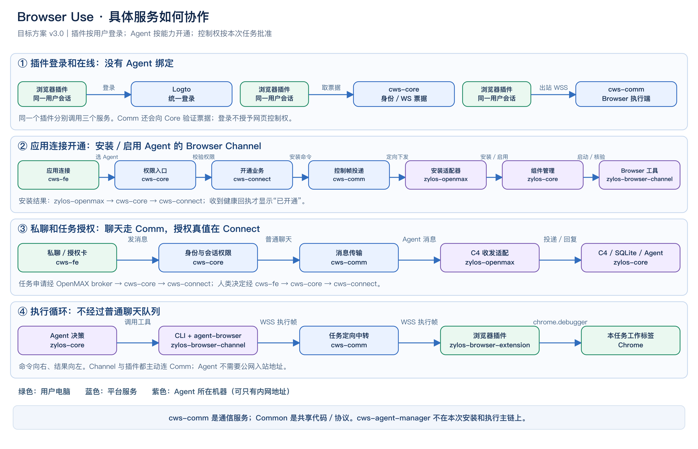
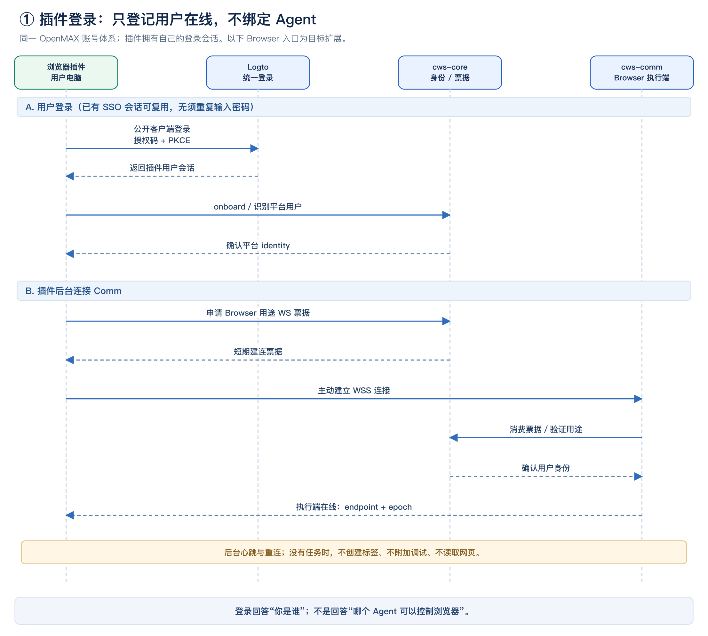
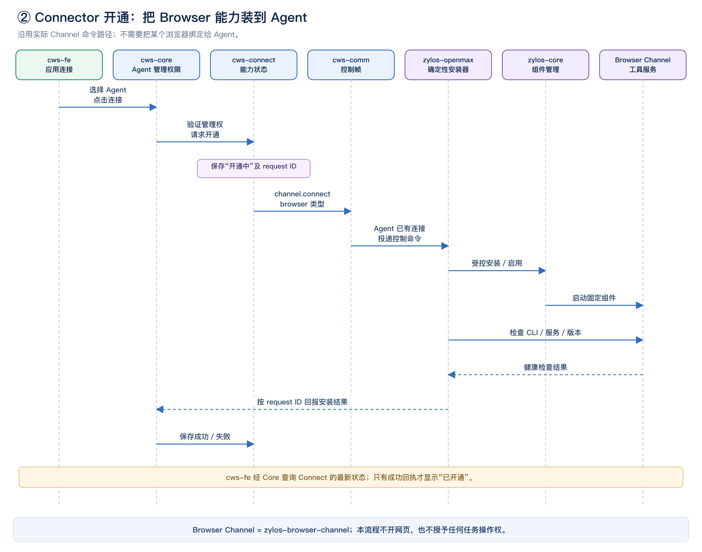
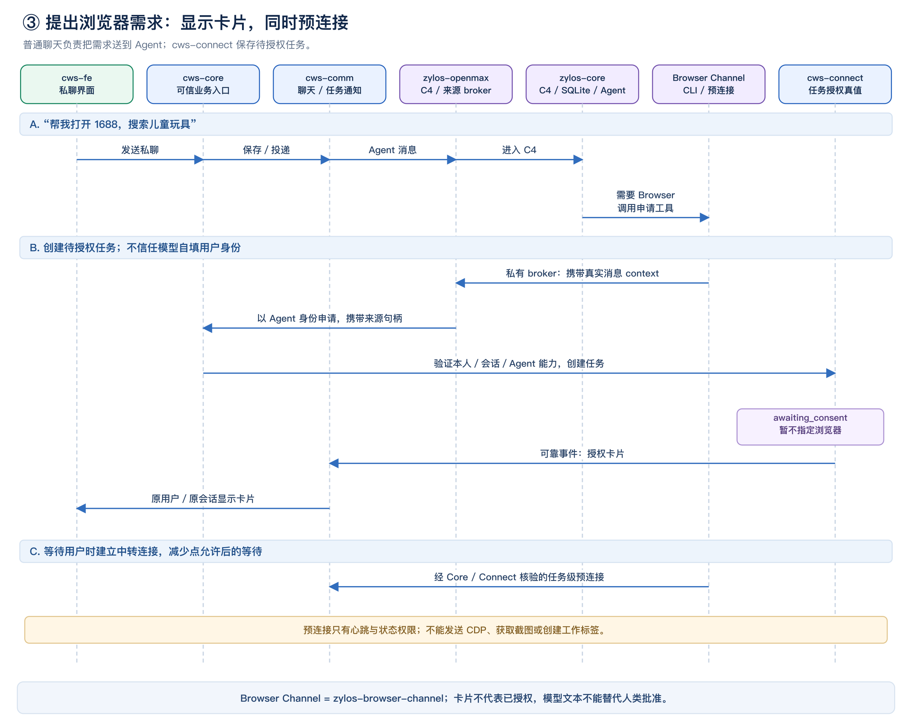
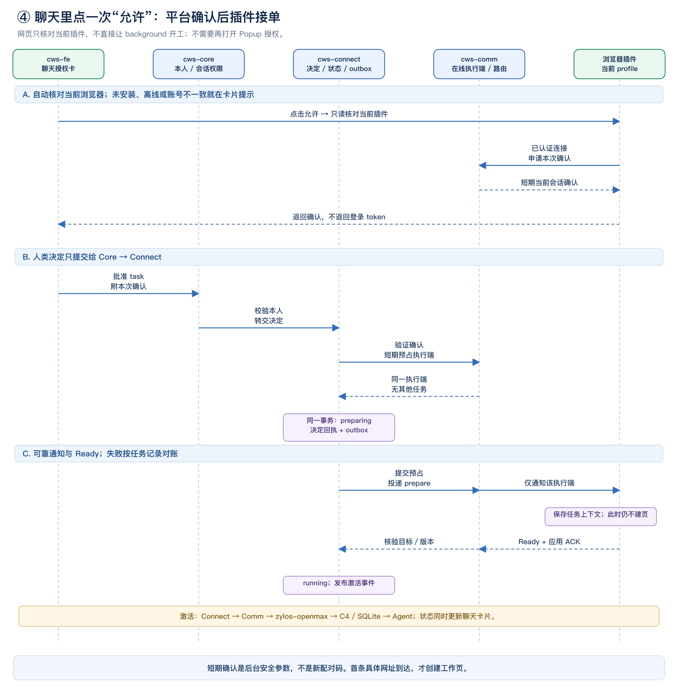
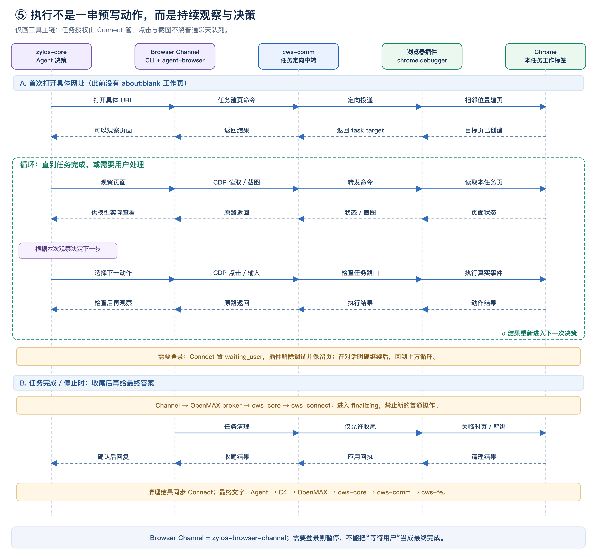
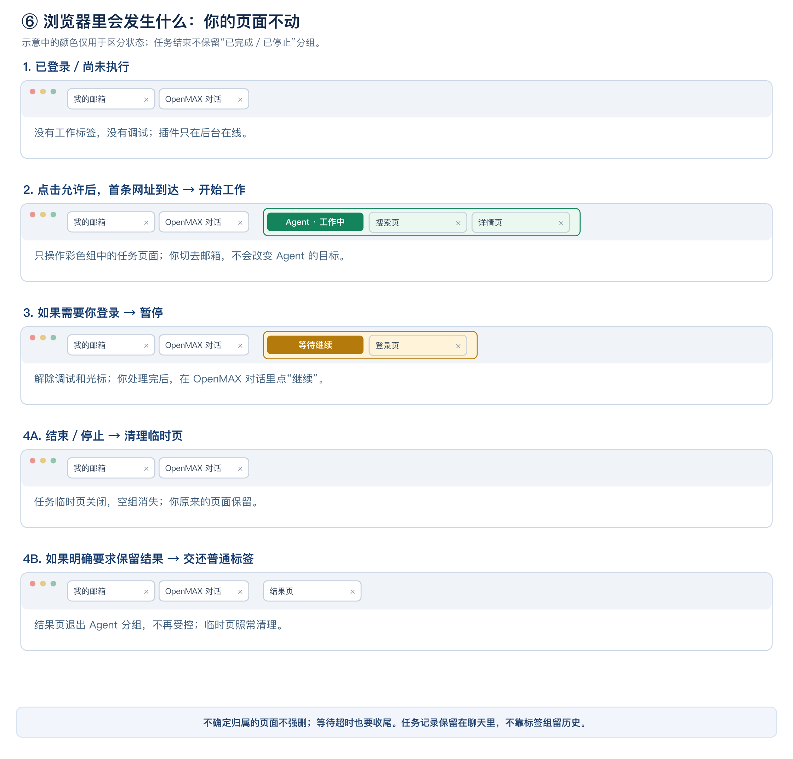

# Browser Use：用户态接入实施设计

版本 3.0 · 2026-09-09 · 目标方案，本地改造进行中

配套评审稿：[Browser Use 插件设计方案评审](review-design.md)。
本版取代“浏览器安装实例长期绑定 Agent”的目标设计。评审稿定义产品规则；本文展开服务接口、数据归属、异常与改造任务。
本文描述目标契约，不代表各项已实现。实际代码、测试与未完成项单独记录在 [本地实施记录](implementation-progress.md)。旧 2.0 实施记录已归档，不把旧测试通过结论套用到本版。

## 1. 不变量和首期边界

1. 插件拥有用户登录态，不拥有长期 Agent 绑定；不要求预选工作区才登录。
2. Connector 的连接动作表示“为 Agent 开通 Browser 能力”，不是用户浏览器控制授权。
3. 任务批准绑定真实发起用户、工作区、会话、Agent、任务和当前浏览器执行端；执行期间不能换目标。
4. 普通聊天、安装控制帧、任务状态事件、浏览器执行帧是不同协议类别，禁止混合广播。
5. 同一执行端一次一个未收尾任务；同一插件可先后服务不同 Agent。首期无跨设备选择／转移、群聊授权。
6. 身份与任务状态由服务验证，不信任模型自填 ID，不把 SKILL.md 当作安全边界。
7. 未授权不观察页面；Ready 不创建标签；首条具体 URL 才建页；结束清理后回复。
8. 断线或重启不自动恢复执行；确认丢失不自动重放网站副作用。后端通知可重复，动作不可盲目重试。

## 2. 服务边界：不是一个笼统的后端

| 仓库 | 目标职责 | 关键边界 |
| --- | --- | --- |
| cws-fe | 应用连接入口、选择 Agent、能力状态、任务卡、当前插件确认 | 仅把用户决定送 Core，不向 background 发送任务启动 |
| cws-core | 公共 HTTP/BFF、用户／Agent 认证、工作区映射、会话与来源权限、WS 票据 | 转发可信 Principal；普通 CDP 不经过 Core |
| cws-connect | 开通业务、任务权威状态、用户决定、执行端占用协调、期限、回执／outbox | 不持有插件登录 token，不运行 CDP |
| cws-comm | 聊天 WS、安装控制帧、Browser 执行端在线目录、任务路由、事件与命令中转 | 只向命中的执行端投递；身份在线不等于可执行 |
| zylos-openmax | 确定性安装器、Agent 平台身份、消息 context broker、C4 续跑与回复 | 用户态 token 不进入 Agent；context 来自真实私聊消息 |
| zylos-core | 本机组件管理、C4/SQLite、模型与工具循环 | SQLite 不是 Browser 平台任务授权库 |
| zylos-browser-channel | CLI/工具契约、受限操作、agent-browser、CDP relay、task-scoped 出站连接 | 控制身份来自 OpenMAX broker，不能用手填 URL 或用户 ID绕过 |
| zylos-browser-extension | Logto 用户会话、Comm 连接、任务执行、标签日志、调试与光标 | 本地标签归属校验和停止兜底 |
| Logto | 统一登录／注册、SSO、用户令牌 | 使用环境对应的 issuer、audience、client 和回调 |

cws-agent-manager 负责实例创建／运行维护，已有实例安装 Browser Channel 不走它的通用 install_skill。
Common（如 cws-common-go、Common Proto SDK）是类型、Principal、通用中间件依赖，不是运行时中转服务。业务接口仍由各服务自有 proto/SDK 定义，不能把 Browser 业务都塞入 Common。

## 3. 已核对的代码依据与新增边界

以下只描述代码事实，图和协议描述目标能力：

| 代码位置 | 核对结果 | 本方案处理 |
| --- | --- | --- |
| cws-connect/internal/app/channel_service.go：Connect、dispatch | Channel 安装／停用统一经 Comm 到 OpenMAX；原 Agent Manager 分支已退出此主链 | 复用；新增 Browser 能力类型和无外部凭据开通规则 |
| cws-connect/internal/adapter/cwscomm/channel_commander.go | PushChannelCommand 接受不等于安装完成；不传用户凭据 | 保留异步回执语义，补可靠重发／对账 |
| zylos-openmax/src/lib/channel-connector.js | 固定组件映射、安装／升级／启用、健康检查、结果上报 | 加入 Browser 映射；适配无需 provider 凭据的流程 |
| zylos-openmax/src/comm-bridge.js：postConnectResult | 安装结果经 Core BFF 回 Connect，并有本地未投递结果队列 | 复用，不让模型“回答安装成功”代替回执 |
| cws-connect/internal/domain/channel.go | 当前目录为 IM channels，没有 Browser | 新增 browser 类型，明确它是执行能力，不是聊天入口 |
| cws-agent-manager/internal/transport/rpc/grpc.go：SendCommand | install_skill 合约占位，运行后端仍返回 unsupported | 不把它画成已有可用安装路径 |
| cws-core/internal/transport/http/auth.go：/auth/ws-ticket | 现有票据要求活跃组织成员；TTL 30 秒 | 浏览器用户态入口需补用途／执行端绑定，不照搬组织级假设 |
| cws-core/internal/transport/auth/dual.go | Logto token 解析全局 identity，再按组织映射 member | 用户连接用 identity；任务时再校验 org/member，不混用二者 |
| cws-comm/internal/transport/ws/handler.go | 普通 WS 自动挂会话订阅、未读同步和用户在线 | 不把执行插件作为普通聊天客户端全量订阅；新增 Browser 入口 |
| cws-comm/internal/transport/browserrelay/handler.go | Demo 使用专用设备身份和任务路由 | 复用隔离／回执思想，改为用户会话 + endpoint + task grant |

部分旧设计文档仍写 Agent Manager 安装或旧 WS 地址，以上实际入口优先。此表不表示新增 Browser 分支已接入这些生产接口。

## 4. 插件登录：同一用户体系，不复制网页令牌

产品入口为 Workspace **个人主页**，不是 Connector：用户从插件点击登录 → 进入 `/workspace/account?browser_login=1` → 确认当前账号 → background 自动接收登录结果。无需选择 Agent、建立 Agent 绑定或回 Popup 二次确认。Connections 仍只负责 Agent 的能力开通。

本地 Demo 使用个人页里的 `BrowserLoginPanel`、现有真实网页身份校验和 code + PKCE 交接，保存独立短期插件开发会话。未登录时沿用 Workspace 的 Logto 登录与回跳，既有 onboarding 门禁保持不变；正式扩展公开客户端配置仍按下节补齐。旧 `/workspace/browser/connect` 仅迁移到个人页，不能直接完成登录回调。

### 4.1 推荐接入

- 插件使用统一 Logto 环境的公开客户端，建议单独注册扩展 client，复用账号及 SSO；同账号体系不要求复用网页的 client_id。
- 使用官方扩展 SDK／OIDC 授权码 + PKCE，配置正式 extension ID、允许的 issuer、API audience、回调与 CORS。包内不放 client_secret。
- background 保管登录会话和刷新状态；Popup 仅展示用户信息／登录入口，内容脚本和网页不读取 token。限制 storage 的访问上下文。
- Core 复用 /auth/logto/onboard 和现有身份解析，关联或按原规则创建账号；不为 Browser 再建用户表，不绕过注册与成员规则。
- 插件以用户身份申请 Browser 用途的 WS ticket，然后连接 Comm 的 Browser 入口。票据只用于建连，不是任务授权，也不是用户手动输入的码。
- 初始在线连接是 account-scoped：环境 + 全局 identity。无须选择 Agent 或工作区；实际任务再解析 org/member 权限。

Logto 官方提供 Chrome 扩展 SDK和共享 IdP 的登录方式；需配置扩展回调及允许源。[Logto 扩展接入](https://docs.logto.io/quick-starts/chrome-extension)
Chrome 的 launchWebAuthFlow 支持非 Google 身份提供方，回调由扩展 ID 派生。[Chrome Identity](https://developer.chrome.com/docs/extensions/reference/api/identity)
公开客户端不能保守 client secret，应走 PKCE。[Logto 客户端类型](https://docs.logto.io/integrate-logto/application-data-structure)

### 4.2 登录状态与退出

网页登录、插件登录是同账号的两个客户端会话，不能假设一边退出会自动清掉另一边。
首期明确：插件退出立即停止其任务并关闭旧连接；网页登录退出至少停止该网页发起的活动任务，是否同时退出插件提供明确选项；全账号撤销由 Core/IdP 的会话失效事件驱动。
刷新失败、成员停用、账号切换时旧任务不得借重连继续。需要服务端会话撤销检查和有界授权租约，不能只靠 JWT 最终过期。

## 5. Connector 开通：复用真实 Channel 命令路径

### 5.1 请求与安装

1. FE 的应用连接页展示 Browser Use，检测安装／登录仅用于用户引导，不创建长期设备绑定。
2. 用户选 Agent 点击连接，FE → Core：核验 Agent 管理权并解析服务认可的 Agent 身份。
3. Core → Connect：确保 Agent 的 browser 能力记录，状态 pending，带 operation/request ID。
4. Connect → Comm：投递 browser 类型的 channel.connect 控制帧；目标是 Agent，不是用户浏览器。
5. Comm → zylos-openmax：经 Agent 已有平台连接送达。帧由确定性控制处理器消费，不投递为普通 LLM 聊天。
6. OpenMAX 根据受控目录调用 zylos-core 组件管理，安装／启用固定版本的 zylos-browser-channel；检查 CLI、服务、broker、协议兼容性。
7. OpenMAX → Core → Connect：对应请求的终态结果。Connect 确认后才展示 connected；FE 通过查询或状态事件更新。

### 5.2 复用和异常

优先复用 channels/agent_channels 与现有安装结果队列，不为 Browser 引入普通 provider OAuth connection_credentials。
“应用连接”是产品入口，不意味着底层一定要走 applications/connections 的外部凭据模型。Browser 的能力记录不能携带浏览器登录凭据。
已有兼容版本只启用／核验；显式升级或版本不兼容时再升级。包名称／来源／版本由可信目录决定，不能接受网页或模型给出的任意仓库和 shell。
重复 connect 对同 Agent/能力幂等。离线／ACK 丢失保持 pending 或 outcome_unknown，按 request ID查询或重投幂等控制命令；失效旧请求不能覆盖新开通／停用。
停用先撤销该 Agent 的活动 Browser 任务，再停止共享 Channel 进程；撤销某一个人的任务不得停掉其他已获准任务使用的共享组件。
安装管理权和任务使用权分开：没有管理权不能安装；即使安装者是 A，任务也必须以真实发起用户本人为对象，不能默认控制 A 的浏览器。

## 6. 用户态 WebSocket 与执行端目录

### 6.1 建连与路由

目标设计在 cws-comm 内新增专用 Browser WS 路由；不是新增微服务，也不是将现有 /ws 改成不鉴权。

- Core 签发 Browser 用途一次性票据，校验受支持的扩展客户端、用户会话与环境；Comm 消费并验证用途。插件自报 client_type 只是提示，不能作为授权依据。
- Comm 给本次连接分配 endpoint_id、connection_epoch，关联已验证 identity_id、环境、扩展产品 ID、协议版本与 last_seen。
- account-scoped 在线只接收本用户被批准的 Browser 任务控制帧，不订阅用户所有聊天、群消息或 DOM。
- Agent Channel 用 Agent 身份申请 task-scoped 票据并主动连 Comm；Core/Connect 验证它就是任务中的 Agent。
- 运行路由为“环境 + task_id + endpoint_id + connection_epoch + activation”。uid 用于验证所有权，不能单独用于广播。
- endpoint_id 不承担身份认证，不是秘密，不代替 token。connection_epoch 失效后旧帧必须拒绝。
- 实际业务 org/member 来自获准任务，Comm 不从插件提供的第一个组织或模型字段推断。Core 的统一 identity 与 org member 不得混为一个 ID。

初版不做跨浏览器选择，但仍保留执行端标识，以免同账号网页／另一 profile 被误选。允许时只使用当前网页确认的执行端，不选“最近在线的一台”。

### 6.2 连接存储和恢复

Comm 管理当前实例 socket；生产在共享 TTL 目录中记录 endpoint → relay instance 路由，复用已有 NATS/Redis 基础设施的适当部分。跨实例只是定向投递，不复用会话 fanout。
重连生成新 epoch；不搬移旧执行权。断线将任务暂停／停止并同步 Connect；后续显式继续要重新核验身份、原 endpoint 的本地任务日志与占用状态。
socket 写入成功不代表插件已应用。任务控制事件有 event ID与应用 ACK，未 ACK 可重发；接收方按 task/revision 去重。
执行帧有尺寸限制、截止时间和背压；停止优先于截图。心跳需符合 service worker 活动条件，兼容版本写入 manifest。[Chrome WebSocket 支持](https://developer.chrome.com/docs/extensions/how-to/web-platform/websockets)

## 7. 卡片、临时授权与 C4 续跑

### 7.1 请求 Browser 能力

消息按 FE → Core → Comm → OpenMAX → C4/SQLite → Agent 投递。Agent 调用 Channel CLI 的 request/ensure 类入口（最终命名待冻结），只交可信 context。
Channel → 私有 OpenMAX broker → Core → Connect，关联真实来源消息。Core/Comm 提供消息真实性与参与者信息，Connect 执行任务授权规则。
拒绝模型伪造 user_id、Agent、会话或 endpoint；来源消息变化／删除，任务创建和同意都需重查。
同一来源消息重复调用返回同一 task。新需求通过新消息、新 task，不能复用旧批准。

待授权任务没有 endpoint。Connect 创建 awaiting_consent 和 outbox，Comm 将卡片事件只发原用户的原会话；FE 以 task ID关联展示，刷新可查询 Connect。
Channel 可同时申请预连接，暂时只收任务状态；普通聊天不阻塞，CLI 不占进程等待用户数分钟。
不能为同一个 task 无限重复生成卡片。未开通工具或安装失败时提示去开通，不能先展示一个永远无法执行的允许按钮。

### 7.2 “当前浏览器确认”只读自动完成

用户点击允许时 FE 向允许的 extension ID 发起只读核对。background 校验可信 origin、顶层、非无痕、sender tab/window、task/revision和短期随机请求关联。
插件通过自己的已认证 Comm 连接取得短期的当前会话确认：绑定任务、来源句柄、用户、endpoint、epoch、请求随机量及有效期。
FE 仅获得该一次性用途确认，不获得用户 access/refresh token。它不允许建页或发 CDP。这是来源校验，不恢复旧配对登记流程。
Connect 收到人类决定后向 Comm 验证确认与在线连接；不能信任 FE 直接传来的 endpoint_id。对话和插件账号不一致、来源页消失、回调重放、连接代次变更均拒绝。
确认的签名／一次性状态应放现有共享安全存储，由 Comm 校验；不能使用仅存在某个进程内的密钥假装能横向扩容。

### 7.3 接受任务的原子性

1. FE → Core → Connect：approve/resume + task + revision + operation ID + 当前会话确认。
2. Core 验证用户登录、工作区成员与原会话；Connect 验证任务本人、Agent 能力、状态、期限和来源版本。
3. Connect → Comm：核验确认并以 task/request ID幂等预占执行端，返回短期 reservation。先完成远程预占，再进入本地数据库事务，避免持锁做远程调用。
4. Connect 事务内 CAS 更新 preparing、目标 endpoint/epoch、activation、deadline，同时写决定回执和 outbox。
5. 提交后出站事件消费者 → Comm：提交 reservation并投递 prepare；失败则重试同一事件，预占超时后回报启动失败。数据库失败须释放预占，释放丢失由 TTL 兜底。
6. Comm 校验 reservation/任务版本，只向该执行端投递；插件保存任务上下文后 ACK，并经 Comm → Connect 回报 Ready。
7. Connect 确认 endpoint/epoch/activation/revision匹配，推进 running，发布激活和状态事件。
8. 激活事件经 Comm → OpenMAX；OpenMAX 按 task/activation幂等进入 C4续跑投递，模型随后发出具体 open。

端点锁与 Connect SQL 不是跨库原子事务；必须使用有界预占、幂等提交、补偿和对账。只有 Connect 的已提交任务授权生效，Comm 的临时 reservation 不能独立发放控制权。
一个 activation 只产生一个有效续跑通知；C4 入库成功与已投递分开，ACK 不明先查询，不重新发送一串动作。原 Demo 的“认领后直接发 C4”不足以宣称可靠投递。
网页刷新／重连读取任务真值，不自动再次 approve。Ready 的重复通知返回当前状态，不能再次唤醒或建页。

## 8. 浏览器工具与任务标签

### 8.1 主体工具链

Agent → 我们的 CLI → Channel 常驻服务 → agent-browser CLI/引擎 → Channel 私有 CDP relay → Comm → background chrome.debugger → 本任务标签。
调用结果原路回到 CLI/Agent；DOM、截图不走普通 IM。请求/状态变更可经 OpenMAX broker → Core → Connect，但不把每条鼠标移动绕经 Core/Connect。
工具说明与允许参数在 Channel 的 SKILL.md / browser-commands；插件只执行受限协议，授权边界在代码。
工具层仍有必要，用于可信 context、参数白名单、租约、任务隔离和结果归并；无需另建工具服务或 MCP 项目。

### 8.2 首个 URL、观察循环与中止

Ready 只表示可接单。首个 open 经受限 bootstrap 命令，在原聊天 tab 所在窗口相邻位置打开真实 HTTP(S) URL；记录归属，返回 task-owned CDP target。
随后 agent-browser 才使用该 target 定位、点击、输入、截图。源 tab 位置失效就提示，不拿当前 active tab 兜底。
每次结果需要实际进入下一次模型决策。截图文件路径必须通过图片读取工具读入，不声称仅有路径已完成视觉观察。
命令有 command ID、执行截止、task/activation/epoch。断线后结果不明标记 outcome_unknown；不自动重放网站提交。超时或停止应中断活动 CLI/引擎并阻断后续命令，不排在长 wait 之后。
敏感输入保护、真实输入事件轨迹与可视光标、工作页目标限制继续复用。

### 8.3 工作标签生命周期

| 状态 | 控制与标签 |
| --- | --- |
| awaiting_consent | 可预连接，但无工作页、CDP、页面观察 |
| preparing | 保存任务上下文，仍不建页 |
| running | 首个 URL 建页；只能操作本任务拥有的标签 |
| waiting_user | 停动作、脱离调试、隐藏光标，保留等待继续组；仅人类明确继续 |
| finalizing | 禁止普通命令，仅允许有界清理 |
| closed | 授权失效；临时页关闭，保留页变普通标签，无终态分组 |

建议待授权 5 分钟、prepare 30 秒、等待用户 10 分钟、任务总计 30 分钟、finalize 30 秒；作为待冻结配置，不宣称已由本版代码实现。
另设短的执行许可失效上界，例如失去有效授权／心跳后最多 30 秒内阻断后续动作；它不同于 30 分钟任务上限。每条命令还受更短截止限制。具体值通过网络与暂停验收确定。
标签日志至少含 task、浏览器本次运行、window、group、tab和keep标记；关闭前再次核验。用户原有页、归属不明页不强删。
收尾结果独立记录 confirmed/partial/unknown/not_required。仅保留在线目录 TTL 不足以判断清理：插件重载后须先上报未收尾日志并处理；Connect 对尚未确认的任务持续设阻断，不能靠换 epoch 清掉。
正常最终回复经 C4 → OpenMAX → Core → Comm → FE；等待说明不等于最终完成。清理有界失败后可以准确回复失败／待人工处理，不永远挂住。

消息与收尾必须解耦，不能用“发送回复时发现任务是 running”推断任务已完成：用户可能在等待提示发出前已经批准。等待／进度消息不改变任务状态；Agent 通过显式 `finalize`／`stop` 完成有界清理，再发送最终结果。最终回复携带任务本轮 activation 关联，适配器只读校验任务已 closed，拒绝提前或过期的最终回复，不代替 Agent 触发收尾。当前 C4 端点约定：普通 `|browser:context` 表示进度；最终结果追加 `|browser-final:activation_id`，复用既有字段，不增加授权步骤或凭据。

插件和 OpenMAX 聊天卡均区分“已授权”和“已有工作页”：running 且尚未创建任务页时显示“已授权，等待 Agent 打开网页”，不出现“查看工作标签”；仅当前任务的实际工作页存在时显示该入口。网页通过 `browser-task-page-state` 只读取得匹配 task/endpoint/epoch 的存在状态，不签发授权、不创建标签；查看、停止等动作仍经平台中转。读取失败不沿用旧的“有页”状态。

首次建页需处理控制通道与状态事件的时序差异：Channel touch 已提交但 WS 更新尚未到达时，插件不能沿用旧 revision。先同步占用本地启动锁、记录恢复日志，再读权威任务、校验同一 owner/endpoint/epoch/activation/session/source 及期限，提交 started。只对服务端明确返回 409 STALE_TASK 的未提交请求有界重读重试（最多三次）；未知网络结果不重放。确认预约成功才创建目标 URL 标签，建页完成才记为 started。失败撤销本地控制并停止/清理任务，不能留下“已启动但没有页”的卡死状态；停止或断线后的迟到响应不得再建页。

## 9. 数据设计：复用什么，删除什么

| 数据 | 所属服务 | 方案 |
| --- | --- | --- |
| identities / memberships / 登录会话 | Logto + Core | 复用身份体系；插件拥有自己的用户会话 |
| channels / agent_channels | Connect | 扩展 browser 能力目录、pending/connected/error与request回执；不包含 endpoint |
| 浏览器在线目录、endpoint预占、epoch | Comm | 本机socket + 共享TTL记录；只存必要路由／身份引用 |
| browser_tasks | Connect | 权威任务记录，endpoint 在同意前为空；closed仍保留清理状态 |
| browser_operation_receipts / browser_outbox | Connect | 复用等价基础设施或保留已有 Browser 实现，事务内一致 |
| C4消息与投递状态 | zylos-core | 沿用 SQLite；补续跑幂等关联，不把平台任务表搬入C4 |
| 标签日志、登录会话 | 插件 | 受限本地存储；登录秘密不上传到业务表，不sync给网页 |

browser_tasks 建议字段：task_id、环境、org_id、owner_identity_id、owner_member_id、agent_identity/member引用、conversation_id、source_message_id/version、endpoint_id（可空）、connection_epoch、activation、state、revision、deadline、absolute_deadline、outcome、cleanup。
同服务外键与唯一性按实际表建约束；跨服务identity/endpoint引用不能假装有数据库外键。任何权限查询都检查环境、任务归属和组织上下文。
来源消息幂等与决定幂等分别处理。相同 operation ID不同请求体拒绝；旧revision不能覆盖新决定。数据过期、审计保留和截图文件清理分开定义。
本版不新增专用 browser_binding_intents、不派发 browser device secret、不保留插件↔Agent长期绑定。无需用 applications/connections/connection_agents模拟 Browser 用户身份；其他外部应用使用这些表的业务不受影响。
浏览器设备可选审计/偏好元数据不等于权限表；首期不为此新增一套长期设备授权系统。登录刷新仍遵循IdP规范，不能把所有短期安全参数都当作“绑定码”删除。

## 10. 接口与事件清单（设计名称，待 SDK 冻结）

| 场景 | 调用方 → 实际服务 | 复用／新增与核心输入 |
| --- | --- | --- |
| 登录／账号关联 | 插件 → Logto、Core /auth/logto/onboard | 复用公开客户端登录与账号关联规则 |
| 插件 WS 票据 | 插件 → Core | 新增 Browser 用户态用途，参照已有 /auth/ws-ticket；绑定client/session/用途 |
| 浏览器 WSS | 插件 → Comm | 新 Browser 执行端入口，不自动订阅普通聊天；握手消费Core票据 |
| 开通／停用 | FE → Core → Connect | 复用 Channel connect/disconnect API体系，扩展browser类型；Agent身份、operation |
| 安装命令 | Connect → Comm → OpenMAX | 复用 PushChannelCommand；受控组件映射、request ID；无用户token |
| 安装结果 | OpenMAX → Core → Connect | 复用 /api/v1/connect/channel-bindings/:id/result |
| 创建任务 | Channel → OpenMAX broker → Core → Connect | 可信context → 实际来源消息；幂等 task |
| 当前执行端确认 | FE → 插件 → Comm | 只读短期证明；task/revision/source/nonce；不批准、不建页 |
| 用户决定 | FE → Core → Connect | approve/deny/resume/stop；operation/revision/current confirmation |
| 核验／预占 | Connect → Comm | 用户与endpoint一致、在线、无冲突、短期reservation |
| prepare／cancel／finalize | Connect outbox → Comm → 指定插件 | task/revision/activation/endpoint/epoch；应用ACK |
| Ready／cleanup | 插件 → Comm → Connect | 绑定活跃任务上下文，有事件ID与对应结果；不可越权改用户决定 |
| 激活／状态通知 | Connect outbox → Comm → OpenMAX/FE | OpenMAX只做C4续跑；FE显示卡片，不广播页面结果 |
| 工具命令／结果 | Channel ↔ Comm ↔ 插件 | command ID、task grant、target scope、deadline、结果大小 |
| 任务查询 | FE/Agent → Core → Connect | 按人或Agent身份限制对象；重连只读对账 |

HTTP有真实认证与CSRF/Origin策略；服务RPC带可信Principal且验证调用服务身份。不能靠公开header声称“内部调用”。
Control grant由Connect权威状态签发/验证，Comm缓存有短期有效性并消费撤销事件；签名密钥／撤销版本跨实例一致。插件只接受已获准的task/activation及本地session，不接受网页下发的任意工具调用。
业务事件至少含event_id、task_id、revision、目标、kind和时间；安装事件与task事件的ID空间/接收角色区分。定向审计日志不得记录token、完整票据、DOM或截图。

## 11. 故障与验收责任

| 场景 | 期望 | 主要责任 |
| --- | --- | --- |
| 登录失败／过期 | 提示登录，旧执行权限不可续；不改其他Agent能力记录 | 插件、Core、Comm |
| 开通离线／无回执 | 不报connected；查询或幂等对账 | Connect、Comm、OpenMAX |
| 同一插件先后用A/B Agent | 无重绑；各自开通且用户各自明确批准 | FE、Connect、Comm |
| 跨账号／跨组织／假消息 | 拒绝任务或决定，不靠模型提示防御 | Core、Connect |
| 同账号另一个浏览器发起 | 当前插件缺失即提示，不路由到别处 | FE、插件、Comm |
| 双任务竞争执行端 | 最多一个进入可执行态，失败者明确busy | Connect、Comm |
| 同意已落库但prepare丢失 | 同一event重投，有限期准备；无空白标签 | Connect、Comm、插件 |
| Ready／激活重复 | 不重复C4续跑、建页或执行 | Connect、OpenMAX、插件 |
| Comm/插件重启、电脑休眠 | 阻断旧epoch；对账清理，不自动恢复任务 | Comm、Connect、插件 |
| 点击结果丢失 | outcome_unknown，查询/观察；不自动重发有副作用动作 | Channel、插件 |
| 停止撞上长工具调用 | 优先撤销并中断，不能等待长调用自然完成 | 全链路 |
| 清理失败／不明 | 记录并提示；不强删用户页，不绕过未清理任务开新任务 | 插件、Connect、Comm |
| 内网Agent | 两端仅出站WSS仍可执行；无CDP公网端口 | Comm、Channel |
| 商店与隐私 | 明确权限/数据流和远程执行边界；不承诺必然过审 | 插件、安全、产品 |

Debugger远程执行例外只覆盖相关API用途；插件本地逻辑、任意下载代码等仍受审核约束。[MV3政策](https://developer.chrome.com/docs/webstore/program-policies/mv3-requirements)
首期所有外部高风险操作都需明确任务范围及必要追加确认。不得以“本次允许浏览器”跳过付款、不可恢复删除、敏感发送等产品安全边界。

## 12. 当前 Demo 到本版：待改清单

| 仓库 | 可复用 | 必须调整 |
| --- | --- | --- |
| zylos-browser-extension | WXT/React、鼠标/截图、task tabs、停止/清理 | 移除binding-start/preview/redeem/设备凭据；接Logto会话、用户态Comm与endpoint确认 |
| zylos-browser-channel | CLI+agent-browser、CDP、context约束、超时 | 新票据/任务路由；去掉device binding依赖；预连接/stop保持 |
| zylos-openmax | 平台会话、消息broker、C4适配、Channel安装器 | 加browser目录映射及无凭据安装、版本核验、可靠activation投递 |
| cws-fe | 任务卡、继续/停止、当前插件只读交互 | Connector改为Agent能力开通；移除长期设备绑定页面；分别显示在线/就绪 |
| cws-core | Logto解析、BFF、Agent/成员权限、WS ticket基础 | Browser用户态票据、正式Browser BFF/SDK、来源与执行端identity映射 |
| cws-connect | Channel服务、任务状态/CAS、receipts/outbox | Browser类型开通；去设备secret/长期绑定；通过Comm确认endpoint/预占 |
| cws-comm | 一般平台连接、安装控制帧、专用Relay隔离思想 | Browser用户连接、定向目录/epoch、共享预占、撤销与应用ACK |
| Common SDK | 既有Principal等跨服务类型 | 仅必要的通用契约更新；Browser RPC由各服务拥有 |
| zylos-core / cws-agent-manager | 组件管理/C4及实例能力 | 优先不改业务代码；核实C4去重能力，不使用未实现install_skill兜底 |

本版接口和登录/任务路由尚未在Demo落地；之前96项插件测试、CLI临时Chrome测试等证明旧实现的部分能力，不能算本版端到端验收。
上一轮启用检查中的账号请求404与Chrome插件重载仍是独立待办，本次未继续排障，不把页面可打开等同于联调完成。

### 12.1 改造顺序

1. 冻结公开客户端登录、identity/org映射、Comm专用入口和当前浏览器确认契约。
2. Core+Comm先打通插件“只登录→在线→退出失效”，无任何Agent绑定。
3. Connect+OpenMAX打通browser开通，验证真实安装/启用回执，无用户凭据下发。
4. 接任务创建、当前浏览器确认、approve/Ready/预连接，确认还没创建任何标签。
5. 复用CLI工具循环与标签清理，完善断线/停止/重复回执/C4对账。
6. 用真实登录账号、本机和仅出站的Agent分别验收，再做正式发布与安全审核。

### 12.2 数据与发布

保持现有改造分支与备份。旧设备绑定不能自动变成用户登录态，也不能自动给新任务授权；用户需走统一登录。
旧活动任务先收尾；先增加新字段/路由和版本协商，再切客户端，拒绝版本混用。新链路稳定、旧数据按保留期归档后，才移除专用旧表/端点。
迁移只处理Browser自有数据，不删除其他Connector连接、账号、聊天或共享表。继续用独立本地Docker验证新增结构，不在测试共享库临时建表。
生产需正式migration、typed SDK、可信origin与回调、共享路由/安全存储、隐私与商店审核。此文不授权直接上线或清空旧库。

## 13. 图文对应和交接

| 图 | 评审稿章节 | 实施细节 |
| --- | --- | --- |
| 01 服务总览 | 2 | 2、3 |
| 02 用户登录 | 3 | 4、6 |
| 03 Agent开通 | 4 | 5 |
| 04 申请/预连接 | 5.1 | 7.1 |
| 05 允许/Ready | 5.2 | 7.2、7.3 |
| 06 执行循环 | 5.3 | 8 |
| 07 标签生命周期 | 6 | 8.3、11 |

图源和PNG一起交付；前后顺序与服务命名使用同一份模型。历史2.0留作旧Demo说明，不能继续作为新产品目标。
