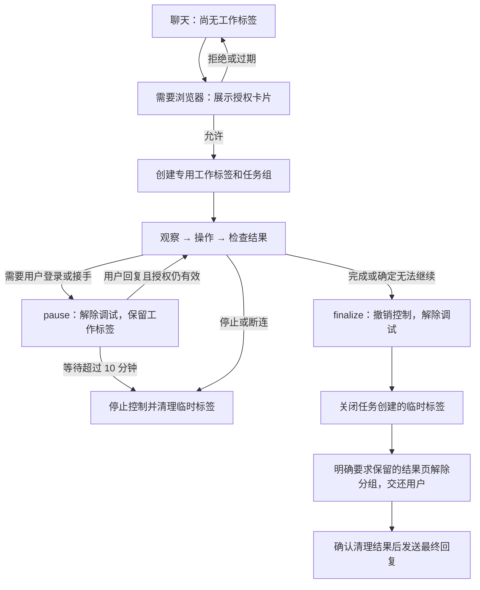

# 工作标签生命周期（0.10.1）

分组只显示“工作中／等待继续”，不显示“已停止／已完成”。结束时关闭登记的临时页、解除保留结果页的分组，空组自然消失。不为了移除分组而操作未登记的用户页面。旧 finish 兼容停驻也显示等待继续，不冒充任务完成。

## 归属与责任

- 插件维护任务 UUID、窗口、分组和明确创建的标签 ID 清单；浏览器当前焦点不决定操作目标。
- Channel 管理授权、CLI 调用与回复屏障；普通聊天仍走 C4／SQLite，不修改 Core。
- Agent 区分 `pause` 与 `finalize --task UUID [--keep ID,ID]`。未显式暂停时，最终回复会兜底 finalize。
- 默认关闭临时工作页。个人原有页、未登记的组成员、已被用户移出工作组的页面均不关闭。
- 保留结果仅依据用户明确意图；解除分组后不再被后续任务清理。
- 配对保留，但 finalize／stop／重启后不能自动恢复任务授权。

## 异常回收

清理清单先写入插件本地存储，保留决策先落盘再关闭页面。收尾按任务 ID 校验，可安全拒绝过期任务；失败保留待清理记录，并显示警告。后台周期重试只处理待清理项，不处理正在创建／执行的任务。

同一浏览器会话内，后台 worker 重启后可核验窗口／组／标签 ID 并回收。浏览器重启、插件重新加载后，若会话标识变更，则不依据旧数字 ID 删除页面：残留页需要用户手动关闭。这是保守的安全边界，不承诺所有崩溃情形下无残留。断连和 stop 不保证未完成的网站写操作被撤销。

`finish` 仅保留旧版本非破坏性停驻兼容语义。旧客户端没有 `task-finalize-v1` 能力时不能执行新收尾命令，需重新加载插件。

实现：`utils/automation/task-lifecycle.ts` 负责清理日志；`executor.ts` 负责授权／调试／任务执行；`background/runtime.ts` 负责恢复与状态显示。
